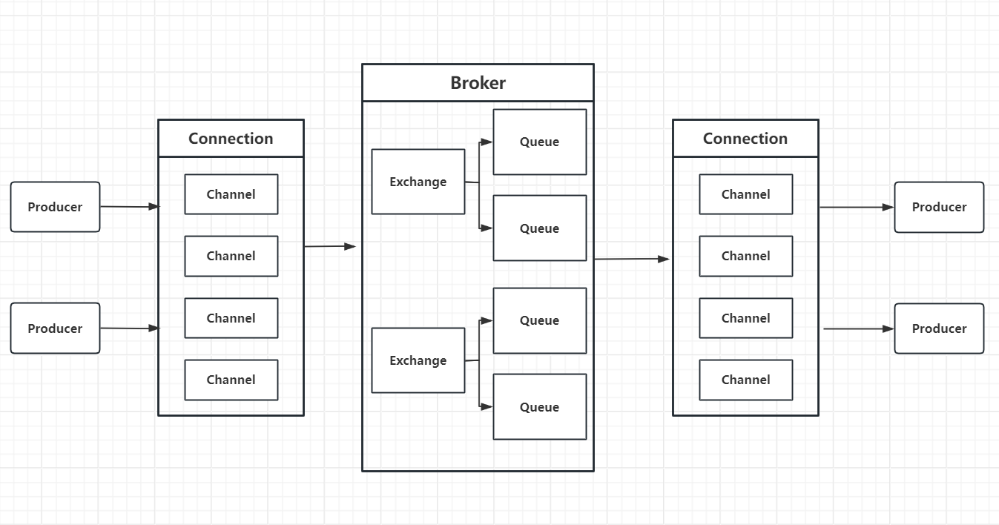
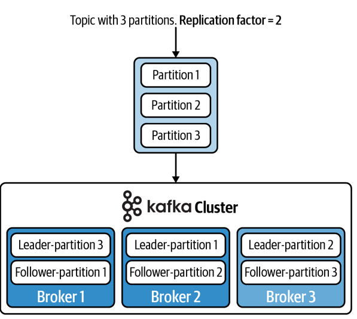
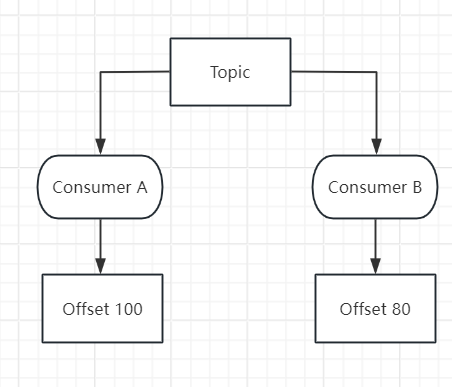

# Message Management in Applications

## 1 Message规范

**Message System 是一种通过消息进行异步通信的应用架构机制，生产者将消息发送至消息代理或逻辑通道，由消费者按照系统定义的路由、订阅或消费模型获取和处理消息，而不一定是客户端之间的点对点通信。**

- 在应用中，message用于传递信息。

- 消息客户端能够向任意其他客户端发送消息，并接收来自任意客户端的消息。

- 通常，每个客户端都连接至一个**消息代理（Broker）**，该代理提供消息的创建、发送、接收及读取功能。

#### 主要构成：

- A header

- Properties (optional)

- A body (optional)

此外，很多实际场景中，Message会被赋予不同的状态，比如有效/过期/错误等等。

#### 优点：

1. **解耦与异步通信**：
   
   - **发送方和接收方不需要同时在线**。消息由代理暂存，接收方可在任何时间连接并获取消息。这是此类系统最大的优势之一。
   
   - **系统组件松耦合**：发送方只需知道接收方的地址（如邮箱、JID），无需关心对方的具体位置、状态或实现细节。

2. **可靠性与持久化**：
   
   - 消息代理可以确保消息不丢失。如果接收方暂时不可达，消息会存储在服务器上，直到成功送达。
   
   - 提供消息历史记录，用户可以回溯查看。

3. **可扩展性与负载均衡**：
   
   - 消息代理可以处理海量客户端连接和消息路由。通过部署多个代理服务器，可以轻松扩展系统规模。
   
   - 代理可以管理复杂的路由逻辑（如群聊、邮件列表），减轻客户端的负担。

4. **安全与集中管理**：
   
   - 身份认证、授权、加密（TLS）可以在代理层面集中实施和管理。
   
   - 便于进行垃圾信息过滤、病毒扫描和内容审计（在企业或合规环境中）。

5. **网络友好性**：
   
   - 客户端通常只需与一个固定的代理保持长连接，可以穿越大多数防火墙和NAT，简化了网络配置。

#### 缺点：

1. **单点故障与性能瓶颈**：
   
   - **消息代理成为系统的核心单点**。如果代理宕机，所有依赖于它的客户端将无法通信。
   
   - 代理可能成为性能瓶颈，所有消息都需经其转发和处理，对服务器的处理能力和带宽要求很高。

2. **复杂性**：
   
   - 需要部署、维护、监控和扩展高可用的消息代理服务器集群，增加了运维复杂度和成本。
   
   - 协议可能较复杂（如XMPP），客户端实现需要考虑多种状态和用例。

3. **隐私与信任问题**：
   
   - 由于所有消息都经过代理，**代理运营者理论上可以访问所有明文消息内容**。用户必须完全信任代理提供者。
   
   - 端到端加密可以缓解此问题，但在此架构中通常需要额外实现，且可能削弱某些服务器功能（如搜索）。

4. **延迟**：
   
   - 与纯P2P直接通信相比，消息需要“客户端 -> 代理 -> 客户端”的跳转，会引入额外的网络延迟，尽管通常很小。

5. **成本与可控性**：
   
   - 运营大型、可靠的代理服务需要持续的资金投入（硬件、带宽、运维）。
   
   - 对于用户或组织而言，依赖于第三方代理服务（如Gmail、WhatsApp）意味着将通信的控制权交给了服务商。

## 2 Loosely Coupled：紧耦合和松耦合

耦合（Coupling）描述系统组件之间相互依赖的程度：

- 紧耦合意味着组件之间存在较强的直接依赖，一个组件的状态、位置、接口或处理能力变化可能直接影响另一个组件；

- 松耦合则通过消息代理等中间机制降低这种直接依赖，使组件能够更独立地运行和演化。

不同的实际场景需要不同的耦合层次和程度，这也决定了不同的message system设计。

### 2.1 时间解耦

- **紧耦合场景**：打电话。要成功通信，双方必须同时拿起电话（在线）。一方不在，通信就立刻失败。

- **松耦合场景**：发邮件或消息。发送者写完就可以发送，无论接收者是否在线。接收者可以在几小时、几天后上线再阅读和回复。消息代理在其中负责存储和转发，解除了通信双方必须“同时在线”的时间约束。

### 2.2 空间/位置解耦

- **紧耦合场景**：直接IP连接。发送者必须知道接收者当前确切的网络地址（IP和端口）。如果接收者更换了网络（比如从WiFi切换到4G），IP地址改变，连接就会中断。

- **松耦合场景**：使用消息代理。发送者只需要知道接收者的**逻辑地址**（如 `alice@domain.com`），而完全不需要知道对方当前的物理位置（IP地址）。消息被发送到代理，由代理这个“中间人”负责根据逻辑地址查找并最终送达接收者。发送者和接收者的网络细节对彼此是隐藏的。

### 2.3 接口/实现解耦

- **紧耦合场景**：一个客户端直接调用另一个客户端的API。如果接收方升级了软件或改变了通信协议，发送方也必须同步升级，否则无法兼容。

- **松耦合场景**：双方都只与**消息代理**这个标准中介对话。只要它们都遵守与代理通信的协议（如SMTP、XMPP），彼此的客户端用什么语言开发、内部如何实现、版本如何升级，都不会直接影响对方。一个用Java写的客户端可以和一个用Python写的客户端无缝通信。

### 2.4 负载/控制流解耦

- **紧耦合场景**：接收方处理能力不足或崩溃，会直接拖慢或拖垮发送方。

- **松耦合场景**：消息代理充当了**缓冲区**。如果接收方处理速度慢或暂时下线，消息会在代理处排队，不会阻塞发送方。发送方发出消息后就可以继续自己的工作，无需等待接收方立即处理完毕。

## 3 Message System的主要工作形式和模式

不同的场景下，需要不同的耦合策略，因此，也需要不同的工作形式。

### 3.1 PTP点对点模式

```
Producer → Queue → Consumer
```

消息产生者产生message后，发送到消息队列，然后被接收者（消费者）接受生效。

需要注意的是：

- 消息**只会被一个 Consumer 消费**

- 消费后，视为消息从队列中移除（实际实现可能略不同，但是被消费的消息一般不能再被消费）

- 每条消息只交付给一个 Consumer，但一个 Queue 可以有多个 Consumer。也就是说，每条消息最终只会分配给其中一个 Consumer，**多个 Consumer 是在“竞争”有限的消息**。

因此，message的生命周期应该是：

- 消息进队列

- 等待某个消费者

- 被成功 ACK 后删除

如果这个过程中，message进入了队列，但是对应的consumer崩溃，那么事务会回滚，然后消息依旧在Queue队列中等待重新投递。

因此，可以说**PTP模式不依赖消费者是否在线**，消费者不在线那么message依旧保存，直到上线后继续消费。

### 3.2 publish/subscribe (pub/sub)模式

这种情况下，要求每个客户端都连接至一个**消息代理（Broker）**，**Broker是消息通信中的中间服务，负责接收 Producer/Publisher 发送的消息，并根据消息系统的规则进行存储、路由和转发，最终将消息提供给对应的 Consumer/Subscriber。**

具体工作流程：

- Publisher产生的消息发送到**Topic**，所有订阅该 Topic 且符合订阅条件的 Subscriber 都可以获得该消息的一份独立消费机会

- 整个过程可以是**一对多**的，即broadcast实现

- 每个订阅者都有自己的“视角”，彼此互不影响，每个订阅者独立 ACK，独立进行事务

- 某个订阅者事务失败，不影响其他订阅者

/01-Message/2026-08-27-14-55-49-image.png)

#### 是否要求订阅者在线？

##### ① 非持久订阅（Non-Durable）

- Subscriber 必须在线

- 不在线就意味着消息丢失

##### ② 持久订阅（Durable Subscription）

- Broker 为每个订阅者保存消息

- 订阅者上线后补收

### 3.3 对比两种策略方式

| 维度        | PTP（Queue）     | Pub/Sub（Topic）  |
| --------- | -------------- | --------------- |
| 消息模型      | 一对一            | 一对多             |
| 消费方式      | 竞争             | 广播              |
| 消息副本      | 1 份            | N 份             |
| 消费者是否必须在线 | 否              | 非持久：是 <br/>持久：否 |
| 是否适合负载均衡  | 是              | 否               |
| 是否支持回放    | 有限             | 持久订阅支持          |
| 常见中间件     | ActiveMQ Queue | ActiveMQ Topic  |

## 4 JMS Browser

前面介绍的 PTP 模式中，消息通常由 Broker 存储在 Queue 中，等待 Consumer 消费。

JMS Browser 提供了一种特殊的访问方式：它允许客户端直接通过 Broker 查看 Queue 中当前等待消费的消息，而不会成为这些消息的 Consumer。

/01-Message/2026-08-27-15-07-37-image.png)

JMS 浏览器允许你“浏览”队列中的消息，并显示每条消息的消息头（header）信息。

即，**以“只读、非破坏性”的方式查看队列中的消息**

也就是说，客户端看得到消息，但是**不会把消息从队列里取走**，不会影响正常消费者

## 5 RabbitMQ：消息队列和代理的具体实现

前面介绍的是通用的消息通信模型，而 RabbitMQ 是这些模型的一种具体实现。

RabbitMQ 是一个广泛使用的开源消息代理（Message Broker）和队列服务器，也被认为是一个面向消息的中间件。它的核心作用是接收、存储和转发消息，让不同的应用程序或服务之间能够进行高效、可靠且灵活的通信。其遵循AMQP协议。

### 5.1 架构组成



- **Producer（生产者）**：产生并发送消息的应用程序。

- **Consumer（消费者）**：从 Queue 中获取并处理消息的应用程序。

- **Message（消息）**：Producer 与 Consumer 之间传递的数据。

- **Broker（消息代理）**：RabbitMQ Server，负责接收、存储、路由和转发消息。

- **Queue（队列）**：Broker 中用于暂存消息的容器，Consumer 通常从 Queue 获取消息。

- **Exchange（交换机）**：接收 Producer 发送的消息，并根据路由规则决定将消息发送到哪些 Queue。这是路由的核心，它**不存储消息**，只负责根据规则将消息分发到一个或多个队列。交换机有四种内置类型：
  
  - **Direct**：完全匹配路由键（Routing Key），消息只被投递到绑定键完全一致的队列。
  
  - **Topic**：支持通配符匹配路由键（`*` 匹配一个单词，`#` 匹配零个或多个单词），适用于多条件过滤。
  
  - **Fanout**：忽略路由键，将消息广播给所有绑定的队列，常用于广播事件。
  
  - **Headers**：根据消息头属性（而非路由键）进行匹配，性能较低，较少使用。

- **Binding（绑定）**：Exchange 与 Queue 之间的关联规则。

- **Routing Key（路由键）**：Producer 发送消息时携带的路由信息，Exchange 可以根据它决定消息的去向。

相比于其他消息中间件（如Kafka），RabbitMQ更侧重于灵活的路由和可靠的消息投递，而不是日志流或吞吐量极致。

### 5.2 基本工作流

#### 5.2.1 基本准备工作

- **建立网络连接**，Client创建TCP连接到RabbitMQ服务器。

- **开启信道**，在 TCP 连接上创建轻量的 Channel（信道），后续所有操作都在信道中进行（常见的是复用连接，多开信道）

- **声明交换机**，客户端向服务端发送 Exchange.Declare 请求，创建指定名称和类型的交换机（如 direct、topic、fanout）。

- **声明队列**，客户端向服务端发送 Queue.Declare 请求，创建队列，并可指定是否持久化、是否自动删除等属性。

- **建立绑定**，客户端发送 Queue.Bind 请求，将队列与交换机绑定，并指定绑定键（Binding Key），定义消息路由规则。

> 生产者和消费者任意一方都可以执行上述声明操作。但为了安全，通常生产者和消费者启动时都会各自声明一遍（声明幂等，相同参数重复声明无副作用）。

#### 5.2.2 发送消息

- **生产者发布消息**，调用 `Basic.Publish` 方法，指定**交换机名**和**路由键（Routing Key）**，并附带消息体（Payload）

- **交换机接收并路由**：
  
  - 交换机根据自身的类型（如 `direct`）和消息携带的 **Routing Key**，逐一匹配绑定的 **Binding Key**。
  
  - **匹配成功**：将消息投递到对应的一个或多个队列。
  
  - **匹配失败**：如果未配置 `mandatory` 或备用交换机（Alternate Exchange），消息会被直接丢弃。

#### 5.2.3 存储、接收和消费

- **消息入队存储**：队列接收消息，按照 FIFO（先进先出）原则存储（这就意味着，单个队列内消息有序）。如果开启了持久化，消息会同步写入磁盘。

- **消费者接收消息：**
  
  - 推模式（Push）：消费者订阅队列（Basic.Consume），队列主动将消息推送给消费者。
  
  - 拉模式（Pull）：消费者主动轮询拉取（Basic.Get），但不推荐高频使用。

- **消费者处理业务：** 收到消息后，执行本地业务逻辑（如更新数据库、发送邮件）。

- **发送消费确认（Ack）:**
  
  - 处理成功后，消费者发送 Basic.Ack 给 RabbitMQ。
  
  - RabbitMQ 收到 Ack 后，将该消息从队列中删除（确保至少成功消费一次）。
  
  - 若消费者未发 Ack 或连接断开，消息会重新入队并投递给其他消费者。

### 5.3 性能特点分析

不同类型的消息可以经过不同的规则被路由到不同队列。这是 RabbitMQ 的强项。

相比较Kafka等，RabbitMQ 对单条消息可能需要进行更多处理。尤其在复杂路由、可靠投递和细粒度确认的场景中，每条消息的处理路径比较“精细”。

RabbitMQ 是 message-oriented：重点是消息的路由与投递；Kafka 是 log/event-stream-oriented：重点是事件的持久化、顺序追加、消费进度与高吞吐分发。

## 6 Kafka

Kafka是一个流式消息处理工具，核心目标是：**高吞吐、可持久化、可扩展、可容错地传输与存储消息流**。

/01-Message/2026-08-27-17-55-58-image.png)

## 6.1 基本架构

#### 6.1.1 Producer（生产者）

- 负责将消息发送到 Kafka

- 不关心消息“被谁消费”

- 只关心**写到哪个 topic 的哪个 partition**

#### 6.1.2 Broker（代理节点）

- Kafka 集群中的服务器

- 每个 Broker 存储多个 **Partition**

- 负责消息的**存储、复制、读取**

#### 6.1.3 Topic（主题）

- 逻辑上的消息分类

- 类似数据库里的“表”

- 一个 Topic **可以**分成多个 Partition

#### 6.1.4 Partition（分区）

- Kafka **并行与性能的核心**

- 每个 Partition 是一个**有序、只追加（append-only）的日志文件**

- Partition 内消息有严格顺序

- 不同 Partition **之间无顺序保证**

#### 6.1.5 Consumer / Consumer Group

- Consumer 主动从 Kafka 拉取数据（pull）

- Consumer Group 共享消费一个 Topic

- **一个 Partition 在同一 Group 中只会被一个 Consumer 消费**

事实上，Kafka Cluster 由多个 Broker 组成，各 Broker 共同承担 Partition 的存储、复制和请求处理；对于每个 Partition，其副本中会选举一个 Leader，其余为 Follower。消息中间件实际上是一个“邮局”。这种设计实现了异步处理。



### 6.2 Kafka partition日志设计

- 无论是PTP还是pub/sub通信，kafka均用Topic处理。

- 处理方式是append-only的日志，效率更高。

- 实际设计中，**用分区（partition）来换取并行性和高吞吐**。

- 在 Kafka 中，一个 **Topic（主题）并不是一个整体文件**，而是被**拆分成多个更小的单元**，这些单元叫做 **Partition（分区）**。每一个 Partition 本质上都是一个**独立的日志（log）文件**：
  
  - 只能**追加写入（append-only）**
  
  - 消息在 Partition 内 **严格有序**
  
  - Producer 向 Partition 写数据
  
  - Consumer 从 Partition 读数据

- 一个 Topic 有多少个 Partition，是**可以配置的**：
  
  - 可以一开始就设定
  
  - 大多数情况下可以 **后期增加**
  
  - 不能轻易减少（会破坏顺序与数据）

Partition 数量可配置，通常 Partition 越多，系统的并行度和吞吐能力就越高。

**Kafka 将分布式日志中每一条记录的位置称为 offset（偏移量）。多个消费者组可以同时从同一个日志中读取数据，并且各自独立地维护自己在该日志（或数据流）中的读取位置。Topic 可以是同构的（只包含一种类型的数据），也可以是异构的（包含多种类型的数据）。**

### 6.3 集群和代理节点

如果partition分布在不同机器上，若一台机器崩溃则整个系统不可用。

因此实际上需要做副本设计。正常工作状态通过心跳机制检测等实现。

**Cluster（集群）** 和 **Broker（代理节点）** ：Cluster 是整体，Broker 是个体；Cluster 提供能力，Broker 执行工作。

### 6.4 Offset

Offset 是消息在某个 Partition 中的唯一顺序位置。Consumer 通过维护 Offset 记录自己的消费进度。

```
Partition 0:

Offset:  0    1    2    3    4    5
        [A]  [B]  [C]  [D]  [E]  [F]
                       ↑
                  Consumer Offset
```

Offset 是 Partition 内部的，不是整个 Topic 全局唯一的。

```
Partition 0:  0 1 2 3 4 ...
Partition 1:  0 1 2 3 4 ...
Partition 2:  0 1 2 3 4 ...
```

Kafka 的一个核心思想可以概括成：**消息的存储与消息的消费进度相分离。**

直接解释了 Kafka 为什么天然支持**多消费者组独立消费和消息回放**。

**多个消费者组可以同时从同一个日志中读取数据，并且各自独立地维护自己在该日志（或数据流）中的读取位置。**



### 6.5 备份

如果没副本，那么对应的broker崩溃后数据就不可用，因此会进行构建replication。

Replication Factor即为备份数量。1个Leader 是该 Partition 的主要读写入口，其他Follower 持续从 Leader 复制数据。

因此 Replication 的主要目的不是“让一个消息可以被两个 Consumer 各消费一次”，而是**让 Partition 在 Broker 故障时仍然能够继续提供服务，并降低数据丢失风险。**

Kafka 中，Partition 是消费和顺序的基本单位，Replica 是容错的基本单位；Consumer 通常从 Partition 的 Leader 读取，而 Follower 主要用于数据复制和故障转移。

写入时 Producer 将消息写入对应 Partition 的 Leader，并由 Leader 将数据复制到 Follower；读取时 Consumer 从该 Partition 的 Leader 拉取消息，并根据 Offset 维护自己的消费进度。

## 7 消息驱动系统

**消息驱动系统（Message-Driven System, MDS）** 是一种以“消息”作为系统运行核心驱动力**的软件架构范式。系统中各个组件**不直接调用彼此，而是通过**发送、接收、处理消息**来协作。可以说，**消息驱动系统是一种通过异步消息进行通信、以事件或消息到达触发业务逻辑执行的系统架构。**

业务事件产生消息，消息触发后续组件执行，各组件通过消息间接协作，从而实现异步处理和松耦合。

一个更简单的例子：日志系统——应用产生 ErrorOccurred 消息，日志服务收到后记录日志，告警服务收到后触发告警，监控服务收到后更新指标；生产日志的应用不需要直接调用这些服务。
