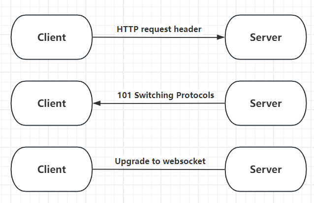

# Websocket Application

## 1 基本概况

前面曾经学到过，HTTP 协议可以进行信息传输。但是是否有一些方案可以克服其通信上的缺点？

我们引入 **WebSocket**。

- WebSocket 是一种应用层协议，它在 TCP 协议之上为客户端与服务器提供**全双工通信**。
- 在传统的 HTTP 请求–响应模型中，客户端请求资源，服务器返回响应，通信主要由客户端发起。
- WebSocket 建立连接后，**客户端和服务器都可以主动发送数据**，不需要每次通信都重新发送 HTTP 请求。
- WebSocket 通常通过 HTTP **握手并升级连接**，之后使用 WebSocket 协议进行持续通信。
- 结合 JavaScript、HTML5 等客户端技术，WebSocket 适用于聊天、实时通知、在线游戏等需要**实时双向通信**的 Web 应用。

## 2 Websocket 协议

WebSocket 是一种基于 TCP 的应用层协议，为客户端与服务器提供持久的全双工通信，实现实时双向数据传输。

### 2.1 WebSocket Endpoint（端点）

- **Endpoint**是服务器暴露的 WebSocket 服务入口

- 类似于：
  
  - HTTP 的 URL
  
  - REST API 的路径

- Endpoint 是 WebSocket 通信的“接入点”

### 2.2 基于 URI 的连接方式

- 客户端通过 **URI** 建立连接

- 协议头：
  
  - `ws://`（明文）
  
  - `wss://`（TLS 加密）

连接本质：

- 先是 **HTTP 请求**

- 然后升级为 **WebSocket**

### 2.3 连接协议的对称性

连接建立后协议是“对称的”，也就是说：

- 客户端和服务器地位平等

- 都可以主动发送消息，不需要等待对方请求

**这是 WebSocket 与 HTTP 的本质区别**

### 2.4 全双工通信（Full-Duplex）

指**通信双方可以同时进行数据发送和接收**，互不需要等待对方完成通信。

例如 WebSocket 中：

> Client ⇄ Server

客户端可以发送消息的同时，服务器也可以主动向客户端发送消息。

###### 2.5 连接生命周期控制

- 无论是 **Client 还是 Server**，任一方都可以主动关闭 WebSocket 连接。
- 使用 WebSocket 的 **Close Frame** 表示关闭连接。
- Close Frame 可以携带：
  - **状态码（Status Code）**
  - **关闭原因（Reason）**
- WebSocket 连接**不是永久存在的**，而是具有明确的建立、通信和关闭生命周期。
- 一个客户端通常维护一个或少量 WebSocket 长连接。
- 一个 **Endpoint（服务器端点）** 可以同时维护并服务**成百上千个客户端连接**。

### 2.6 WebSocket 的两大协议阶段



#### 2.6.1 Handshake（握手阶段）

Handshake 基于 **HTTP** 进行，使用 **Upgrade** 升级机制。握手成功后，HTTP 阶段结束，WebSocket 数据传输阶段开始。

具体过程：

- **客户端发起连接请求**，使用 WebSocket Endpoint 的 URI。
- **客户端发送 HTTP 请求头**，告诉服务器：
  - 想升级到 WebSocket
  - WebSocket 版本
  - 一个随机生成的 Key（用于安全校验）
- **服务器返回 `101 Switching Protocols` 响应**：
  - 表示同意协议升级
  - 返回对应的 Accept Key
- **握手完成，连接升级为 WebSocket**
  - 之后客户端和服务器可以进行全双工通信。

#### 2.6.2 Data Transfer（数据传输阶段）

- 使用 **WebSocket Frame** 进行数据传输。
- **不再使用 HTTP**。
- 支持：
  - 文本帧
  - 二进制帧
  - Ping / Pong
  - Close

因此，WebSocket 建立的是一个**长期保持、低开销的双向通信通道**。

| 组件        | 说明                                                                                                                    |
| --------- | --------------------------------------------------------------------------------------------------------------------- |
| **协议方案**  | **`ws`**：表示**未加密**的 WebSocket 连接。<br>**`wss`**：表示**加密**的 WebSocket 连接（相当于 HTTPS 上的 WS）。                               |
| **主机与端口** | **`host:port`**：指定服务器地址。<br>• **`port`（端口）为可选组件**。如果省略，则使用默认端口：<br>- `ws` 协议默认端口为 **80**。<br>- `wss` 协议默认端口为 **443**。 |
| **路径**    | **`/path`**：用于指示该 WebSocket 端点（服务）在服务器上的具体位置（类似于网站URL的路径）。                                                            |
| **查询字符串** | **`?query`**：**可选组件**。可用于在连接握手时向服务器传递附加参数。                                                                            |

#### 2.6.3 并发安全

一个 Endpoint 可以同时服务大量客户端，因此服务器需要考虑并发安全。

例如，服务器需要维护所有在线客户端时，可以使用 ConcurrentHashMap 等并发安全的数据结构，避免多个 WebSocket 连接同时访问共享数据导致线程安全问题。

> 注意：ConcurrentHashMap 属于服务器端并发编程问题，并非 WebSocket 协议本身的组成部分。

## 3 Creating and Deploying a WebSocket Endpoint

- 主要过程：创建类 → 实现生命周期 → 加业务逻辑 → 部署到 Web 应用

### 3.1 **Create an endpoint class（创建端点类）**

- **作用**：定义一个 WebSocket 服务的入口

- **核心**：端点类就是客户端连接的“接入点”

就具体实现来说，一种思路是**注解式**实现。

```java
import jakarta.websocket.server.ServerEndpoint;

@ServerEndpoint("/chat")
public class ChatEndpoint {
    // 业务逻辑和生命周期方法在这里实现
}
```

除了注解，或者考虑 **程序化(Programmatic Endpoint)** 实现类似效果。

- 需要在 **`ServerApplicationConfig`** 中手动注册 Endpoint

- 更灵活，可以动态生成 Endpoint

| 维度   | 注解式                    | 程序化                              |
| ---- | ---------------------- | -------------------------------- |
| 注册方式 | 自动扫描 `@ServerEndpoint` | 手动在 `ServerApplicationConfig` 注册 |
| 灵活性  | 静态 URI                 | 动态 URI，动态 Endpoint 类             |
| 适合场景 | 大多数常规应用                | 高度动态/复杂注册需求                      |

注解式简单直接，程序化更灵活。

要创建一个编程式端点（programmatic endpoint），你需要继承 `Endpoint` 类并重写它的生命周期方法。  
要创建一个注解式端点（annotated endpoint），你需要在一个 Java 类及其部分方法上使用上述包提供的注解进行标注。

### 3.2 **Implement the lifecycle methods of the endpoint（实现生命周期方法）**

- WebSocket 连接有完整生命周期，**生命周期方法**对应客户端连接事件：

| 方法          | 触发时机    | 说明                  |
| ----------- | ------- | ------------------- |
| `onOpen`    | 客户端连接成功 | 初始化 session，发送欢迎消息等 |
| `onMessage` | 收到客户端消息 | 处理业务消息              |
| `onClose`   | 连接关闭    | 清理资源、通知其他客户端        |
| `onError`   | 发生异常    | 日志记录、异常处理           |

- **生命周期方法是端点类的核心骨架**，服务器通过这些方法响应 WebSocket 连接在**建立、通信、关闭和异常**等不同阶段的事件。

### 3.3 **Add your business logic to the endpoint（添加业务逻辑）**

- 在 `onOpen`、`onMessage` 等生命周期方法中加入实际的**业务逻辑**。
- 例如：
  - `onOpen`：用户连接后进行初始化、发送欢迎消息。
  - `onMessage`：接收并处理客户端发送的业务数据。
  - `onClose`：用户离开后更新在线状态、清理相关资源。

### 3.4 **Deploy the endpoint inside a web application（部署到 Web 应用）**

- Endpoint 需要运行在支持 WebSocket 的 **Web 容器**中。
- **部署方式：**
  1. 将 Web 应用打包为 `.war` 文件。
  2. 部署到 Tomcat、Jetty、WildFly、GlassFish 等支持 WebSocket 的服务器。
  3. 容器扫描 `@ServerEndpoint` 注解，或通过程序化方式注册 Endpoint。
- 客户端通过 WebSocket URI 访问 Endpoint：

```
ws://host:port/context/endpoint
```

- 如果使用加密连接，则使用：

```
wss://host:port/context/endpoint
```

**整体流程：实现 Endpoint → 编写生命周期与业务逻辑 → 部署到 Web 容器 → 客户端通过 WebSocket URI 建立连接。**

## 4 编码和解码

Java WebSocket API 提供了一套标准机制，用于在 **WebSocket 消息**（网络传输格式）和 **自定义Java对象**（应用程序中的业务模型）之间进行自动转换。

| 组件      | 角色       | 工作方向                     | 典型输出/输入                                       |
| ------- | -------- | ------------------------ | --------------------------------------------- |
| **编码器** | **序列化**  | **Java对象 → WebSocket消息** | 将对象转换为 **JSON、XML 或二进制格式** 的字符串或字节流，以便通过网络发送。 |
| **解码器** | **反序列化** | **WebSocket消息 → Java对象** | 将接收到的 **JSON、XML 或二进制消息** 解析并还原为Java应用程序中的对象。 |

**核心价值：解耦与简化**

- **解耦业务逻辑与消息处理**：开发者无需在业务代码中手动拼接JSON或解析字节。他们可以直接处理熟悉的Java对象。

- **简化应用程序**：API自动处理对象与消息之间的转换，使代码更清晰、更易于维护，开发者可以更专注于业务逻辑本身。

这个过程中还可以使用泛型。GMS（异步信息处理系统）中，初始化和销毁过程需要注意资源的管理；Decoder的验证机制还可以避免恶意信息的注入。

### 5 Handle Error

### 5.1 Throwable

- **定义**：Java 中所有**可被抛出（throw）的对象**的超类。
- **作用**：作为 Java 异常和错误体系的根类。
- **主要子类：**
  1. **`Error`**：通常表示 JVM 或系统层面的严重问题，一般不建议程序捕获，例如 `OutOfMemoryError`。
  2. **`Exception`**：表示程序运行过程中可能出现、通常可以处理的异常。
- 可以使用 `throw` 主动抛出 `Throwable` 及其子类对象。
- 可以使用 `try-catch` 捕获异常。
- **所有可以被抛出的异常和错误都继承自 `Throwable`。**

### 5.2 Exception

- **定义**：`Throwable` 的子类，用于表示程序运行过程中可以处理的异常情况。
- **主要分为：**
  1. **受检异常（Checked Exception）**
     - 编译器要求必须进行处理：**捕获或声明抛出**。
     - 例如：`IOException`、`SQLException`。
  2. **运行时异常（Unchecked Exception / RuntimeException）**
     - 编译器**不要求必须捕获或声明抛出**。
     - 通常表示程序运行时出现的错误。
     - 例如：`NullPointerException`、`ArrayIndexOutOfBoundsException`。


