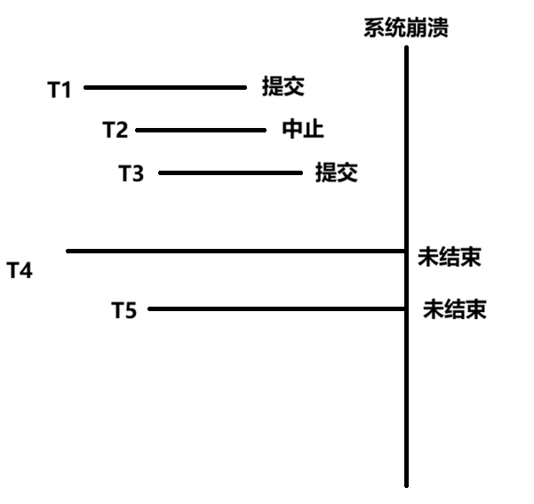

# Transaction Management

## 1 JTA、JTS规范

### 1.1 JTA — Java Transaction API

**全称**：Java Transaction API  

**作用**：提供一个**标准接口**，让 Java 应用可以管理事务（Transaction），不必依赖底层事务管理器的具体实现。

#### 1.1.1 核心目标

- 对应用程序透明地管理事务。

- 支持分布式事务（Distributed Transaction），例如同一事务中可能操作多个数据库或者消息中间件。

- 允许不同类型的资源（数据库、消息队列等）参与同一个事务。

#### 1.1.2 使用场景

- 多个数据库操作必须在同一事务中成功或失败。

- 消息队列和数据库操作需要保证一致性。

- 应用服务器（如 WebLogic、JBoss/WildFly）提供 JTA 支持。

### 1.2 JTS — Java Transaction Service

**全称**：Java Transaction Service

**作用**：是 **JTA 的底层实现规范**，遵循 **OMG（Object Management Group）的 OTS — Object Transaction Service 标准**。

#### 1.2.1 核心目标

- 提供事务的 **分布式协调和管理服务**，即实现 JTA 的真正“分布式事务引擎”。

- 支持分布式环境中的事务协调，包括两阶段提交（2PC）。

#### 1.2.1 特点

- **JTA 是接口**，JTS 是具体的事务服务实现。

- JTS 能够在不同服务器、不同资源之间保证事务一致性。

- 在 EJB 规范中，JTS 常由应用服务器底层提供，对开发者透明。（the EJB container sets the boundaries of the transactions.）

## 2 Transaction 事务

事务（Transaction）是指一组操作的最小工作单位 ，这些操作要么全部完成，要么全部不做，不能只执行其中一部分。

换句话说，事务保证了操作的 **原子性和一致性**。

| 特性  | 英文          | 含义                                 | 举例                     |
| --- | ----------- | ---------------------------------- | ---------------------- |
| 原子性 | Atomicity   | 事务要么全部成功，要么全部失败，不会只完成一部分           | 转账操作：扣钱和收钱必须同时成功       |
| 一致性 | Consistency | 事务执行前后，系统状态必须保持一致，一个正确状态转移到另一个正确状态 | 数据库余额总和保持不变            |
| 隔离性 | Isolation   | 并发执行的事务不会互相干扰                      | 两个人同时转账，不会互相覆盖对方数据     |
| 持久性 | Durability  | 事务一旦提交，对数据的修改是永久性的，即使系统崩溃也不会丢失     | 转账成功后，即使服务器宕机，账户余额仍然正确 |

### 2.1 事务的六种边界（传播行为）

**事务传播行为（Transaction Propagation）** 指当一个事务方法调用另一个事务方法时，**被调用方法如何处理当前已经存在的、未结束的事务**，即决定是加入当前事务、创建新事务、挂起当前事务，还是以非事务方式执行。

#### 2.1.1 Required（默认）

- **含义**：如果当前存在事务，则加入该事务；如果没有，则新建一个事务。

- **失败处理**：直接回滚到最初状态，即可视为所有事务实际上是一个大的事务。

```css
调用方法A（已有事务） -> REQUIRED -> 加入事务A
调用方法B（无事务） -> REQUIRED -> 新建事务B
```

#### 2.1.2 RequiresNew

- **含义**：总是新建一个事务，如果当前存在事务，则挂起原事务。

- **典型场景**：独立的操作，需要立即提交，比如日志写入。

```css
调用方法A（已有事务） -> REQUIRES_NEW -> 暂停事务A，创建新事务B
事务B提交后恢复事务A
```

#### 2.1.3 Not Supported

- **含义**：不使用事务执行，如果当前有事务，则挂起原事务。

- **典型场景**：一些不需要事务的操作，比如调用外部服务或执行大批量日志写入。

```css
事务A：创建订单
    ↓
NOT_SUPPORTED：发送监控数据
    ↓
挂起事务A → 非事务执行 → 完成 → 恢复事务A
```

#### 2.1.4 Supported

- **含义**：如果当前有事务，则加入；如果没有事务，也可以执行（非事务执行）。

- **典型场景**：读操作可支持事务，但不强制。

```css
事务A：转账操作
    ↓
SUPPORTED：查询账户余额（读操作）
    ↓
有事务A → 加入事务A → 读取 → 返回
无事务 → 非事务读取 → 返回
```

#### 2.1.5 Never

- **含义**：必须在没有事务的环境中执行，如果存在事务，则抛异常。

- **典型场景**：不允许事务参与的方法，避免事务带来的回滚风险。

```css
事务A：正在执行
    ↓
NEVER：调用外部统计接口
    ↓
检测到事务A → 抛出异常（IllegalTransactionStateException）
```

#### 2.1.6 Mandatory

- **含义**：必须在已有事务中执行，如果没有事务，则抛异常。

- **典型场景**：方法必须在事务环境中执行，否则业务不安全。

```css
调用方法（无事务） -> MANDATORY -> 抛出异常
事务A：创建订单
    ↓
MANDATORY：扣减库存
    ↓
加入事务A → 执行 → 随事务A提交或回滚
```

**表格总结：**

| 传播行为              | 当前有事务         | 当前无事务 | 典型场景           |
| ----------------- | ------------- | ----- | -------------- |
| **Required**（默认）  | 加入当前事务        | 新建事务  | 常规业务操作，默认首选    |
| **RequiresNew**   | 挂起当前事务，新建独立事务 | 新建事务  | 需独立提交的操作，如日志写入 |
| **Not Supported** | 挂起当前事务，非事务执行  | 非事务执行 | 外部服务调用、大批量日志写入 |
| **Supported**     | 加入当前事务        | 非事务执行 | 读操作，可参与事务但不强制  |
| **Never**         | 抛出异常          | 非事务执行 | 禁止事务参与，避免回滚风险  |
| **Mandatory**     | 加入当前事务        | 抛出异常  | 必须在事务中执行的核心操作  |

上述六种都要求操作的是事务性资源，需要的时候可以进行回滚。而事务的回滚以及对应资源的处理，要求存在**事务资源管理器**。

### 2.2 Before-after 机制

事务资源管理器在方法调用前后会做 **事务边界控制**，包括：

1. **Before（方法执行前）**：
   
   - 判断当前是否已有事务。
   
   - 根据 **事务传播行为（Propagation）** 决定：
     
     - 使用已有事务
     
     - 新建事务
     
     - 挂起现有事务
     
     - 抛异常拒绝事务
   
   - 保存当前事务状态（如果需要挂起）。

2. **After（方法执行后）**：
   
   - 判断方法执行是否成功（是否抛出异常）。
   
   - 根据事务传播规则决定：
     
     - 提交事务
     
     - 回滚事务
     
     - 恢复挂起的事务

在 **Before 阶段**，事务管理器决定当前方法是否需要一个事务，以及如何处理已有事务。

方法执行完后，事务管理器会根据 **执行结果和事务规则**做处理：

1. **事务提交或回滚**
   
   - 默认策略：
     
     - **运行时异常（RuntimeException）** → 回滚
     
     - **检查异常（Checked Exception）** → 提交（可配置回滚策略）
   
   - `REQUIRES_NEW` 创建的新事务独立提交或回滚，不影响挂起的事务。

2. **挂起事务恢复**
   
   - 如果 Before 阶段挂起了事务（如 REQUIRES_NEW 或 NOT_SUPPORTED），After 阶段会恢复挂起的事务。

3. **清理线程绑定状态**
   
   - 事务信息通常绑定到当前线程（ThreadLocal），After 阶段会清理，避免线程复用问题。

这一过程还需要管理内存和变量。

### 2.3 事务的隔离属性

| 隔离级别                           | 注解写法                                                     | 可能出现的并发问题       | 说明                                                                    |
| ------------------------------ | -------------------------------------------------------- | --------------- | --------------------------------------------------------------------- |
| **读未提交**<br>（READ_UNCOMMITTED） | `@Transactional(isolation = Isolation.READ_UNCOMMITTED)` | **脏读**、不可重复读、幻读 | 最低级别，一个事务可以读取另一个未提交事务的修改。性能最好，但数据一致性最差，**几乎从不使用**。                    |
| **读已提交**<br>（READ_COMMITTED）   | `@Transactional(isolation = Isolation.READ_COMMITTED)`   | 不可重复读、幻读        | 只能读取已提交的数据，避免了脏读。这是 **SQL Server、Oracle** 等数据库的默认隔离级别。                |
| **可重复读**<br>（REPEATABLE_READ）  | `@Transactional(isolation = Isolation.REPEATABLE_READ)`  | 幻读              | 保证同一事务中多次读取同一数据结果一致（通过行锁或MVCC），避免了不可重复读。这是 **MySQL（InnoDB）** 的默认隔离级别。 |
| **串行化**<br>（SERIALIZABLE）      | `@Transactional(isolation = Isolation.SERIALIZABLE)`     | 无（避免所有问题）       | 最强级别，事务串行执行，通过表级锁强制事务排序。性能最低，数据一致性最高，一般用于极严格场景。                       |

数据库在处理并发事务时可能出现三类问题：

1. **脏读（Dirty Read）**：事务读取到另一个事务未提交的数据。

2. **不可重复读（Non-Repeatable Read）**：同一事务中多次读取同一数据行，结果不同（因为其他事务修改并提交了）。

3. **幻读（Phantom Read）**：同一事务中两次查询同一条件的数据集合，结果行数不同（因为其他事务插入或删除了行）。

| 隔离级别                       | 脏读  | 不可重复读 | 幻读  | 特点                           |
| -------------------------- | --- | ----- | --- | ---------------------------- |
| **READ UNCOMMITTED**（未提交读） | ✅允许 | ✅允许   | ✅允许 | 最低隔离级别，效率最高，可能读取未提交数据        |
| **READ COMMITTED**（提交读）    | ❌禁止 | ✅允许   | ✅允许 | 每次读取只看到已提交的数据，但同一行可能多次读取不同结果 |
| **REPEATABLE READ**（可重复读）  | ❌禁止 | ❌禁止   | ✅允许 | 同一行多次读取结果一致，但新插入行可能被看到       |
| **SERIALIZABLE**（可串行化）     | ❌禁止 | ❌禁止   | ❌禁止 | 最高隔离级别，相当于事务串行执行，避免所有并发问题    |

隔离等级高，数据出错概率低，但是性能也更差。

## 3 读写锁机制

为了实现事务隔离、避免脏读和资源管理的混乱，需要引入锁机制管理资源。一种应用上常见的是读写者锁。

| 锁类型    | 别名       | 作用规则                                                                        | 解决的问题                             | 允许的操作 |
| ------ | -------- | --------------------------------------------------------------------------- | --------------------------------- | ----- |
| **读锁** | 共享锁      | 1. 阻止其他事务**修改**被锁数据。<br>2. **允许**其他事务加读锁来**读取**。<br>3. 持有锁的事务自身**也不能修改**数据。 | **防止不可重复读**（保证事务内多次读取同一数据结果一致）。   | 并发读   |
| **写锁** | 排他锁、独占写锁 | 1. 阻止其他事务**读取或修改**被锁数据（严格定义）。<br>2. **允许**持有锁的事务**读取和修改**自己的未提交数据。          | 保证数据更新的原子性，**防止脏读**（如果严格阻止其他事务读）。 | 独占读写  |

**锁的兼容性矩阵**：

- **读锁** 与 **读锁**：**兼容**（多个事务可同时持有同一数据的读锁）。

- **读锁** 与 **写锁**：**不兼容**。

- **写锁** 与 **写锁**：**不兼容**。

资源管理的两种思路：**乐观控制和悲观控制**

| 机制       | 核心思想                                  | 优点                   | 缺点 / 问题                               |
| -------- | ------------------------------------- | -------------------- | ------------------------------------- |
| **基于锁**  | **悲观控制**：在访问数据前先加锁，阻止其他事务的冲突操作。       | 保证强一致性，实现直观。         | 可能造成**锁等待、死锁**，影响并发性能。                |
| **基于快照** | **乐观控制**：为每个事务提供一个数据的历史版本视图，避免直接锁定数据。 | **高并发**，无锁竞争，读写互不阻塞。 | 数据**非实时**，是过去某一时刻的视图；需要维护多版本数据，有存储开销。 |

**独占写锁**（Exclusive write locks）用于**更新操作**。

- 独占写锁会阻止其他事务在当前事务完成之前**读取或修改该数据**。

- 它还能防止其他事务出现**脏读**。

数据库本身可以设置隔离级别。

## 4 分布式事务

**分布式事务**是指一个事务操作涉及 **多个独立的资源或系统**，例如多个数据库、消息队列或者微服务，每个资源都有自己独立的事务控制，但需要保证整个操作 **要么全部成功，要么全部失败**。简单理解，是“跨系统的事务”，保证不同系统间的数据一致性。因此实现上存在一定的困难。

为此我们给出了解决方案：**两阶段提交协议**

### 4.1 两阶段提交（2PC, Two-Phase Commit）

**流程：**

1. **准备阶段（Prepare Phase）**
   
   - 协调者询问各参与者是否可以提交事务。
   
   - 各参与者执行操作，但不提交，只返回“准备好”或“失败”。

2. **提交阶段（Commit Phase）**
   
   - 如果所有参与者都准备好 → 协调者发出 **提交指令**
   
   - 否则 → 协调者发出 **回滚指令**
- 优点：保证全局一致性 

- 缺点：阻塞，性能较低，如果协调者挂掉，可能出现严重的锁等待

### 4.2 乐观和悲观

如果隔离级别低，那么意味着更乐观，效率更高。

#### 4.2.1 乐观离线锁

**乐观离线锁（Optimistic Offline Lock）** 通过**在提交前验证一个会话所做的修改不会与另一个会话的修改冲突**来解决并发问题。

- **获取乐观离线锁**的方式是：验证自从会话加载某条记录以来，没有其他会话对其进行修改。

- 这种锁可以在**任何时间获取**，但只在**获取它的系统事务（system transaction）期间有效**。

因此，为了确保一个业务事务不会破坏记录数据，它必须在**应用修改到数据库的系统事务中**，对其**每一个修改集成员**获取乐观离线锁。

最常见的实现方式是：**为系统中的每条记录关联一个版本号**。  
在使用关系型数据库（RDBMS）时，验证过程通常是**在更新或删除记录的 SQL 语句中，将版本号作为条件**，确保操作只作用于没有被其他会话修改过的记录。

#### 4.2.2 悲观离线锁

**悲观离线锁（Pessimistic OfflineLock）** 通过**事先加锁来避免数据冲突**。

实现悲观离线锁一般分为三个阶段：

1. **确定需要的锁类型**（Determine lock type）

2. **构建锁管理器**（Build a lock manager）

3. **定义业务事务使用锁的流程**（Define procedures for transactions to use locks）

| 锁类型                            | 说明                 | 备注                  |
| ------------------------------ | ------------------ | ------------------- |
| **独占写锁（Exclusive Write Lock）** | 事务修改数据前获取，阻止其他事务读写 | 保证数据修改的安全性          |
| **独占读锁（Exclusive Read Lock）**  | 事务读取数据前获取，阻止其他事务修改 | 保障读取一致性             |
| **读写锁（Read/Write Lock）**       | 可以选择只读或写           | 读锁与写锁互斥；多个事务可以同时加读锁 |

### 4.3 Coarse-Grained Lock

**粗粒度锁（Coarse-Grained Lock）** 是指**锁定范围较大的数据单元**的一种锁策略。

- 通常锁定**整张表、整个对象或整个记录集合**，而不是单条记录或字段。

- 事务在操作数据前，获取这个“粗粒度”的锁，直到事务结束才释放。

| 特性     | 粗粒度锁（Coarse-Grained） | 细粒度锁（Fine-Grained） |
| ------ | -------------------- | ------------------ |
| 锁定范围   | 大（表、对象集合）            | 小（单行记录、字段）         |
| 并发性    | 低                    | 高                  |
| 锁管理复杂度 | 简单                   | 复杂                 |
| 死锁概率   | 低                    | 相对高                |
| 适用场景   | 系统简单或数据量小            | 高并发系统或大数据量         |

## 5 调度（Schedule）

调度是系统在**事务并发执行过程中**，用于**确定各个事务中所有操作（读/写）最终执行顺序**的一种安排。

| 概念         | 定义                                                                                                      |
| ---------- | ------------------------------------------------------------------------------------------------------- |
| **串行调度**   | 多个事务**按顺序一个接一个地执行**，前一个事务的所有操作完成后，才启动下一个事务。这是最简单的调度方式。                                                  |
| **可串行化调度** | 一个并发调度 **S**，如果其执行结果与**某个串行调度 S’** 的执行结果**完全相同**（在任何初始数据库状态下），则称调度 **S** 是**可串行化的**。这是并发控制正确性的**核心标准**。 |

并发控制的目标是**产生可串行化的调度**，这样既能获得并发执行的高性能，又能保证数据的正确性（如同事务串行执行一样）。

实际做法通常是：找到**可串行化调度的一个子集**，作为充分条件。

- **原理**：只要调度满足这个**更严格的子集条件**，它就**一定**是可串行化的（但可能排除掉一些实际上也是可串行化的调度）。

- **好处**：
  
  1. **效率**：可以设计高效的并发控制协议（如两段锁协议、时间戳排序）来直接生成满足该子集的调度，而无需事后复杂校验。
  
  2. **可实现**：在系统运行时即可提前确保调度的正确性。

**常见子集示例**：

- **冲突可串行化**：通过判断操作间的“冲突”关系（如对同一数据的读写、写写）来构建优先图，是实际中最常用、最高效的判定依据。

- **视图可串行化**：条件更宽松但判定更复杂，理论上更完备，但实践中较少直接用于并发控制协议。

### 5.1 冲突可串行化

判定一个调度 S 是否冲突可串行化的核心思想是：**能否通过一系列“等价交换”，将其转换为一个串行调度 S’**。如果能，则 S 是冲突可串行化的。

#### 5.1.1 关键定义：等价交换

- 一次**交换**是指交换调度序列中**两个相邻的操作**。

- 如果交换前后，**两个调度在任意数据库初始状态下都能产生相同的最终结果（即保持数据一致性）**，则称这次交换是**等价交换**，交换前后的两个调度是**冲突等价**的。

#### 5.1.2 操作冲突规则

两个操作是否“冲突”，决定了它们能否交换：

| 操作1       | 操作2       | 数据项    | 结论           | 解释                                   |
| --------- | --------- | ------ | ------------ | ------------------------------------ |
| `R_T1(A)` | `R_T2(A)` | **相同** | **可交换**（无冲突） | 两个读操作不改变数据，顺序无关紧要。                   |
| `R_T1(A)` | `W_T2(B)` | **不同** | **可交换**（无冲突） | 操作不同数据，互不影响。                         |
| `W_T1(A)` | `R_T2(B)` | **不同** | **可交换**（无冲突） | 操作不同数据，互不影响。                         |
| `W_T1(A)` | `W_T2(B)` | **不同** | **可交换**（无冲突） | 操作不同数据，互不影响。                         |
| `R_T1(A)` | `W_T2(A)` | **相同** | **不可交换**（冲突） | 交换顺序会改变 `T1` 读到的值（先读旧值还是读 `T2` 的新值）。 |
| `W_T1(A)` | `R_T2(A)` | **相同** | **不可交换**（冲突） | 交换顺序会改变 `T2` 读到的值（读旧值还是读 `T1` 的新值）。  |
| `W_T1(A)` | `W_T2(A)` | **相同** | **不可交换**（冲突） | 交换顺序会改变数据的最终值（由谁最后写入）。               |

**判断冲突的核心三要素**：当两个操作**来自不同事务**、**作用于同一数据项**，并且**至少有一个是写操作**时，它们就是**冲突**的，顺序不可交换。

### 5.2 三种冲突

- **读写冲突**（Read-Write）
- **写写冲突**（Write-Write）
- **写读冲突**（Write-Read）

另一种判定思路是画出有向优先图（Precedence Graph），给出不同步骤的依赖关系：**优先图无环是冲突可串行化的充要条件**。

## 6 原子性与持久性

### 6.1 原子性的保证与性能影响

原子性要求事务要么全部完成，要么全部不生效。

| 做法              | 实现机制/原理                                                                                       | 对性能的影响                                              |
| --------------- | --------------------------------------------------------------------------------------------- | --------------------------------------------------- |
| **① 事务运行期间不刷盘** | 采用 **Undo Logging（回滚日志）**。事务的所有修改先留在内存缓冲区，仅将“如何撤销修改”的信息（Undo Log）顺序写入日志文件。故障重启后，根据日志回滚未提交的事务。 | **性能高**：事务执行过程中无随机磁盘 I/O，仅需向日志文件追加顺序写。这是主流数据库的实现方式。 |
| **② 事务运行期间刷盘**  | 将未提交事务的**数据页直接写入磁盘**。故障重启后，需要识别并回滚这些“脏”数据。                                                    | **性能低**：每次修改都可能触发昂贵的随机磁盘写；恢复复杂；现代数据库已基本不采用此做法。      |

### 6.2 持久性的保证与性能影响

持久性要求一旦事务提交，其结果必须永久保存。

| 做法             | 实现机制/原理                                                                 | 对性能的影响                                                                    |
| -------------- | ----------------------------------------------------------------------- | ------------------------------------------------------------------------- |
| **① 事务完成时刷盘**  | **强制写日志**：在事务提交前，必须保证其对应的所有 **Redo Log（重做日志）** 已持久化到磁盘。此后，数据页可以在后台异步刷盘。 | 提交需等待日志刷盘（一次顺序 I/O），会增加单次事务响应时间；但日志是顺序追加写，系统整体吞吐量仍然很高。这是保证**严格持久性**的标准做法。 |
| **② 事务完成时不刷盘** | **延迟写入**：提交后，日志和数据都可能仍留在内存缓冲区，依赖操作系统定期刷盘或电池后备缓存。                        | **性能极高**（提交瞬间完成），但若提交后、刷盘前系统崩溃，**已提交事务会丢失**，违反持久性。仅用于可容忍少量数据丢失的非关键场景。     |

### 6.3 WAL 标准实践

现代数据库通常结合上述策略，形成 **WAL（Write-Ahead Logging）** 协议：

- **运行时**：通过写 **Undo Log** 保证原子性，且不刷数据页（性能好）。
- **提交时**：强制写 **Redo Log** 保证持久性（安全可靠）。
- **恢复时**：先重做（Redo）所有已提交事务，再回滚（Undo）所有未提交事务。

核心权衡：

- **安全性越高，性能代价越大**：每一次同步的磁盘 I/O（强制刷盘）都是性能的主要瓶颈。
- **性能优化方向**：通过**组提交**、**非易失性内存**等技术，在确保安全的前提下，减少 I/O 次数或使用更快的持久化介质。

### 6.4 崩溃恢复场景



先明确两个概念：

- **脏页（Dirty Page）**：内存页面已更新，但对应的磁盘页面尚未更新。
- **刷脏（Flush）**：将内存中的脏页写回磁盘。

假设系统崩溃时，事务可能处于三种状态（结合时间线示意）：

| 事务    | 崩溃前状态               | 说明            |
| ----- | ------------------- | ------------- |
| T1、T3 | **已提交（Commit）**     | 崩溃前已成功提交      |
| T2    | **已中止（Abort）**      | 崩溃前已主动中止/回滚完成 |
| T4、T5 | **未结束（Unfinished）** | 崩溃时仍在执行中      |

恢复动作取决于「事务状态 × 是否已刷脏」：

| 事务状态                | 已刷脏                                       | 未刷脏                                           |
| ------------------- | ----------------------------------------- | --------------------------------------------- |
| **提交（Commit）**      | 无需处理（数据已安全落盘）                             | **重做（Redo）**：日志显示已提交，但数据可能未落盘，需按日志重放          |
| **中止（Abort）**       | 无需处理（回滚结果已落盘）                             | **重做（Redo）**：期间可能刷过脏，abort 时未刷干净，需按日志恢复到中止后状态 |
| **未完成（Unfinished）** | **回滚（Rollback/Undo）**：未提交修改已落盘，必须撤销以保证原子性 | 无需处理（修改从未落盘，内存丢失即等同于未发生）                      |

按事务类别再归纳：

1. **T1 / T3（崩溃前已提交）**
   
   - 未刷脏 → 影响**持久性**，需要 **Redo**
   - 已刷脏 → 持久性不受影响

2. **T2（崩溃前已中止）**
   
   - 期间刷过脏，但 abort 时未刷脏 → 影响**持久性**，需要 **Redo**
   - 已刷脏 → 持久性不受影响

3. **T4 / T5（崩溃时未结束）**
   
   - 已刷脏 → 影响**原子性**，需要 **Rollback**
   - 未刷脏 → 原子性不受影响

## 7 崩溃策略设计

### 7.1 原子性策略：STEAL / NO-STEAL

该策略关注事务**执行过程中**，未提交事务修改过的脏页能否写回磁盘。

| 策略                | 核心规则                                   | 对原子性的影响                                  | 关键特征                           |
| ----------------- | -------------------------------------- | ---------------------------------------- | ------------------------------ |
| **NO-STEAL（非窃取）** | **禁止**将未提交事务修改的脏页写回磁盘                  | **自动保证**：未提交数据永不落盘，故障重启后内存丢失即等同于事务未发生    | 实现简单，但要求缓冲池有足够空间，可能因页面置换而阻塞事务  |
| **STEAL（窃取）**     | **允许**将未提交事务修改的脏页写回磁盘（通常因缓冲池空间不足被“窃取”） | **需要回滚**：磁盘上可能存在脏数据，必须依靠 **Undo Log** 回滚 | 提高内存利用率与并发度，但必须配合 Undo Logging |

### 7.2 持久性策略：FORCE / NO-FORCE

该策略关注事务**提交后**，其修改过的脏页是否必须立即写回磁盘。

| 策略                | 核心规则                             | 对持久性的影响                                     | 关键特征                                       |
| ----------------- | -------------------------------- | ------------------------------------------- | ------------------------------------------ |
| **FORCE（强制）**     | **强制**在事务提交时，将其修改的所有脏页**同步写回磁盘** | **自动保证**：提交完成后数据已持久化，故障重启后无需重做              | 强持久性，但提交延迟高（需等待随机磁盘 I/O），严重损害性能            |
| **NO-FORCE（非强制）** | **不强制**在提交时立即写回脏页，可在后台异步刷盘       | **需要重做**：若已提交事务的脏页尚未写盘，必须依靠 **Redo Log** 重做 | 极大提升性能（提交仅需写日志），是现代数据库标配，必须配合 Redo Logging |

### 7.3 策略组合与日志需求

|                       | **FORCE**（提交强制刷盘）    | **NO-FORCE**（提交非强制刷盘）    |
| --------------------- | -------------------- | ------------------------ |
| **NO-STEAL**（执行期间不刷盘） | 无 Redo \| 无 Undo     | **有 Redo** \| 无 Undo     |
| **STEAL**（执行期间可刷盘）    | 无 Redo \| **有 Undo** | **有 Redo** \| **有 Undo** |

说明：

1. **现代数据库的通用选择**：**STEAL + NO-FORCE**
   
   - 最大化性能和并发能力（内存利用率 + 提交速度）
   - 代价是必须实现完整的 WAL，同时维护 **Undo Log**（STEAL 下回滚）和 **Redo Log**（NO-FORCE 下重做）

2. **与恢复过程的关系**：
   
   - 采用 **STEAL** → 恢复时需要 **UNDO**
   - 采用 **NO-FORCE** → 恢复时需要 **REDO**
   - 因此现代数据库的恢复过程通常是 **先 REDO 再 UNDO**

## 8 Undo 与 Redo 日志

### 8.1 Undo 日志

**格式**：`<T, X, V_old>`

- **T**：事务的唯一标识符
- **X**：数据项
- **V_old**：数据项修改以前的值

**产生时机**：当事务 T 修改数据项 X（Write(X)）时产生。

**作用**：实现事务回滚。

**注意**：一般还包含日志序号 **LSN（Log Sequential Number）**。

### 8.2 Redo 日志

**格式**：`<T, X, V_new>`

- **T**：事务的唯一标识符
- **X**：数据项
- **V_new**：数据项修改以后的值

**产生时机**：当事务 T 修改数据项 X（Write(X)）时产生。

**作用**：实现事务重做。

**注意**：一般还包含日志序号 **LSN（Log Sequential Number）**。

### 8.3 基于 Redo / Undo 的恢复对比

| 项目              | 基于 Redo 日志的恢复                                                                                                                | 基于 Undo 日志的恢复                                                                                                                              |
| --------------- | ---------------------------------------------------------------------------------------------------------------------------- | ------------------------------------------------------------------------------------------------------------------------------------------ |
| **正常事务 T 执行流程** | 1. 开始：写入 `<T start>`<br>2. 修改 X：写入 `<T, X, V_new>`<br>3. 提交：写入 `<T commit>` 并刷日志盘；脏页允许刷盘（若无不活跃事务）<br>4. Abort：失效缓冲区中 T 修改的页面 | 1. 开始：写入 `<T start>`<br>2. 修改 X：写入 `<T, X, V_old>`<br>3. 提交：脏页刷盘 → 写入 `<T commit>` → 刷 Undo 日志盘<br>4. Abort：脏页及 Undo 日志刷盘 → 写入 `<T abort>` |
| **日志记录内容**      | 记录**修改后**的值 `V_new`                                                                                                          | 记录**修改前**的值 `V_old`                                                                                                                        |
| **脏页刷盘时机**      | 未提交事务的脏页**不允许**刷盘                                                                                                            | 脏页**允许**刷盘，但需先刷 Undo 日志                                                                                                                    |
| **页面淘汰规则**      | 只允许淘汰无活跃事务关联的页面                                                                                                              | 淘汰页面时需将页面及对应 Undo 日志刷盘                                                                                                                     |
| **回滚流程**        | 1. 废弃 T 关联的脏页<br>2. 写入 `<T abort>`                                                                                           | 1. 反向扫描 T 的 Undo 日志并执行回滚<br>2. 刷回滚产生的脏页<br>3. 写入 `<T abort>`                                                                               |
| **适用场景**        | 系统崩溃后**重做**已提交事务的修改                                                                                                          | 系统崩溃或事务中止时**撤销**未提交事务的修改                                                                                                                   |

## 9 日志记录方案

### 9.1 物理日志（Physical Log）

**定义**：记录数据库 **页或记录的物理修改**，即“存储层面具体发生了什么变化”。

**特点**：

1. **记录粒度小**：记录数据页的字节变化或记录内容的 before/after image。
2. **效率较低**：每次修改都需要写详细物理信息，日志量大。
3. **恢复简单**：恢复时可直接将数据页恢复到之前状态。
4. **适用场景**：数据库底层恢复，支持精确回滚；常用于 **Redo Log**。

### 9.2 逻辑日志（Logical Log）

**定义**：记录数据库 **操作语义或逻辑操作**，即“发生了什么操作”，而不是具体物理数据变化。

**特点**：

1. **记录粒度大**：记录操作本身，例如 `UPDATE account SET balance = balance + 20 WHERE id=1`。
2. **效率较高**：只记录操作指令，日志量小。
3. **恢复复杂**：恢复时需要重演操作，依赖数据库当前状态。
4. **适用场景**：高层事务日志、分布式数据库、逻辑回滚；常用于 **Undo Log**。

### 9.3 物理逻辑日志（Physiological Log）

**定义**：结合物理日志和逻辑日志的混合方法。

**特点**：

- 日志记录中包含数据页面的物理信息（如页面编号）。
- 页面内对具体数据项的修改信息则以逻辑方式记录（如“字段 A 从值 V1 改为 V2”）。
- 常用于 **Undo Log**。
- 用于回滚时（尤其是索引页面分裂），可通过页面前后指针完成回滚。

### 9.4 三种日志对比

| 日志类型       | 解析速度 | 日志量 | 可重做性 | 幂等性 | 可逆性 | 典型应用     |
| ---------- | ---- | --- | ---- | --- | --- | -------- |
| **物理日志**   | 快    | 大   | 是    | 是   | 否   | Redo Log |
| **逻辑日志**   | 慢    | 小   | 否    | 否   | 是   | Undo Log |
| **物理逻辑日志** | 较快   | 中   | 是    | 否   | 否   | Undo Log |

### 9.5 日志的三个重要性质

| 性质         | 定义                        | 示例                                       | 物理日志 vs 逻辑日志                                      |
| ---------- | ------------------------- | ---------------------------------------- | ------------------------------------------------- |
| **幂等性**    | 一条日志无论执行一次还是多次，结果都一致      | `x = x + 1` 不幂等；`x = 0` 幂等               | **物理日志满足**；逻辑日志不满足                                |
| **失败可重做性** | 一条日志执行失败后，是否可以重新执行以达到恢复目的 | 插入记录失败后再次插入可能成功                          | **物理日志满足**；逻辑日志不满足（例如插入数据页成功但插入索引失败，重做整个逻辑操作可能失败） |
| **操作可逆性**  | 逆向执行日志操作，可恢复到执行前状态        | 第 10 页第 100 偏移量由 20 改为 21，逆操作是由 21 改回 20 | **物理日志通常不可逆**（位置可能已被后续操作修改）；**逻辑日志通常可逆**          |
