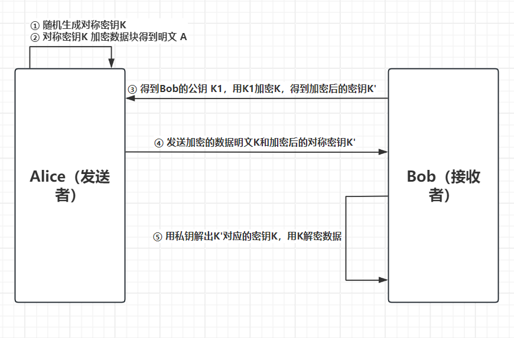

# Architecture Security

## 1 加密

在网络通信和数据存储过程中，数据可能会被**窃听、截获或泄露**。如果数据以明文形式传输或保存，一旦攻击者获得这些数据，就可以直接读取其中的信息。

因此，需要通过**加密**将明文转换为只有拥有正确密钥的人才能恢复的密文，从而保护数据的**机密性（Confidentiality）**。

### 1.1 对称加密

对称加密是一种基础的加密方式，核心思路是加密和解密用同样一个密钥。

示例：

```
明文：Hello

        ↓ 使用密钥 K 加密

密文：X7#a91...

        ↓ 使用相同的密钥 K 解密

明文：Hello
```

对称加密**速度很快，适合大批量数据的加密**，但是问题在于，一旦密钥泄露，攻击者就可以快速获得数据。

因此，对称加密的核心难点在于如何**高效安全分发密钥**。

### 1.2 非对称加密

#### 1.2.1 公钥（Public Key）

- 可以公开给任何人

- 用于 **加密消息**或 **验证签名**

#### 1.2.2 私钥（Private Key）

- 只能自己保管

- 用于 **解密消息**或 **生成签名**

- **不可能用公钥直接得到私钥**

#### 1.2.3 基本思路

**核心思路是，用公钥加密，私钥解密；或用私钥签名，公钥验证**

- **密钥生成**
  
  - 接收方生成一对密钥：公钥和私钥
  
  - 公钥可以发送给发送方，私钥保留自己手里

- **加密消息**
  
  - 发送方使用接收方的公钥加密消息
  
  - 加密后消息只能被对应的私钥解密

- **解密消息**
  
  - 接收方用自己的私钥解密收到的消息
  
  - 这样保证了只有接收方能读取内容

### 1.3 消息摘要

消息摘要**是数据块的数字指纹**。

例如，SHA1 可以将任意长度的数据块压缩为一串 **160 位（20 字节）** 的值。这个值的大小与原消息大小无关。

消息摘要主要具有以下特性：

1. **雪崩效应（Avalanche Effect）**  ：原始数据发生很小的变化，即使只改变一个比特，得到的摘要也应产生显著变化。
2. **抗碰撞性（Collision Resistance）** ：攻击者很难找到两个不同的消息，使它们具有相同的消息摘要。
3. **单向性** ：已知消息摘要后，不能在实际可行的计算量内，反推出原始消息。

加密的目的是隐藏数据内容；消息摘要的目的是为数据提供一个难以伪造的“指纹”，防止数据块在不知情的情况下被恶意篡改。

### 1.4 签名和身份验证

#### 1.4.1 身份验证和数字签名

**数字签名（Digital Signature）** 可以用于验证消息的**发送者身份**以及消息的**完整性**。

- **消息签名**
  
  - 发送方使用自己的私钥对消息生成数字签名，在实际运用中，数字签名通常不是直接对整个消息使用私钥加密，**而是先计算消息摘要，再对摘要进行签名。**
  
  - 签名可以附在消息上发送

- **验证签名**
  
  - 接收方使用发送方的公钥验证签名
  
  - 如果签名正确，说明消息确实由发送方发出，且内容未被篡改

#### 1.4.2 证书 (Certificate)

- **定义**：证书是一个 **包含公钥及其所有者信息的数字文档**，并由可信方签名，用于证明公钥属于某个实体（人、公司、服务器等）。

- **主要内容**：
  
  1. 公钥（Public Key）
  
  2. 所属者信息（名字、组织、邮箱、域名等）
  
  3. 有效期（开始日期/结束日期）
  
  4. 签发者信息（谁签发的证书）
  
  5. 签名（由签发者私钥生成，用于验证证书的真实性）

- **作用**：保证 **公钥归属可信实体**，防止冒名使用。

- **示例**：
  
  - Alice 想让别人相信她的公钥是真实的，就可以申请证书。
  
  - 证书中会写明 Alice 的公钥和她的身份信息，并由 CA（证书颁发机构）签名。

#### 1.4.3 证书签名(Certificate Signing)

- **定义**：证书签名是 **用私钥对证书内容（公钥 + 所有者信息）生成数字签名** 的过程。

- **目的**：
  
  1. 证明证书的真实性
  
  2. 证书内容在传输过程中没有被篡改
  
  3. 建立信任链（由可信 CA 签发证书）

- **过程**：
  
  1. 用户生成公钥和证书请求（Certificate Signing Request, CSR）
  
  2. CA 用自己的 **私钥** 对 CSR 签名
  
  3. 签名后的证书就可以分发给他人，别人用 CA 的 **公钥** 验证签名

```nginx
Alice 公钥 + Alice 信息 → 申请签名 → CA 用私钥签名 → Alice 证书
Cindy 收到证书 → 用 CA 公钥验证签名 → 确认公钥属于 Alice
```

#### 1.4.4 JAR签名

**JAR 签名（JAR Signing）** 是 Java 中利用**数字签名**保护 JAR 文件完整性和来源可信度的一种机制。

基本流程如下：

1. **ACME 生成密钥对**
   - 生成一对公钥和私钥。
   - 私钥由 ACME/程序发布者自己保管。
   - 公钥用于验证签名。
2. **导出公钥证书**
   - 将公钥放入数字证书中。
   - 将证书加入客户端的**信任库（Truststore）**。
   - 客户端因此可以建立对 ACME 公钥的信任。
3. **程序员打包 JAR 文件**
4. **使用私钥对 JAR 进行签名**
   - 对 JAR 中的文件计算摘要。
   - 使用私钥生成数字签名。
   - 最终得到带有签名信息的 JAR。
5. **客户端验证签名**
   - 使用信任的公钥证书获取 ACME 的公钥。
   - 使用公钥验证 JAR 的签名。
   - 验证通过则说明：
     - JAR 的内容**没有被篡改**；
     - 签名确实对应于 ACME 所持有的私钥。

### 1.5 密钥交换问题

前面提到了，大批量的数据加密一般用的是对称加密，但是对称加密的密钥交换是一个大问题。双方必须安全地交换密钥。

一个实现思路是混合加密。

#### 1.5.1 混合加密

- **思路**：用对称加密加密大的数据块，用公钥加密对称密钥

- **流程**（用例子说明）



1. **生成对称密钥**
   
   - Alice 随机生成一个对称加密密钥（比如 AES key）

2. **加密数据**
   
   - Alice 用对称密钥加密消息内容，得到加密的明文

3. **加密对称密钥**
   
   - Alice 用 Bob 的公钥加密刚生成的对称密钥，得到加密的密钥

4. **发送给 Bob**
   
   - Alice 发送 **加密的对称密钥 + 加密的消息**

5. **Bob 解密**
   
   - Bob 用自己的私钥解密出对称密钥
   
   - 用解密出的对称密钥解密消息

## 2 哈希函数

**哈希函数（Hash Function）** 是一种将**任意长度的数据映射为固定长度结果**的函数。

这个结果称为**哈希值（Hash Value）** 或**消息摘要（Message Digest）**。

### 2.1 快哈希和慢哈希

根据计算速度，可以将用于密码处理的哈希算法大致分为**快哈希（Fast Hash）** 和 **慢哈希（Slow Hash）**。

**快哈希**的特点是计算速度非常快，例如 SHA-256。速度快对于文件完整性校验、数字签名等场景非常有用，但对于**密码存储**反而存在安全问题，**攻击者可以高速尝试大量密码。**

因此，对于密码存储场景而言，我们需要慢哈希。慢哈希会**人为增加计算成本**，使攻击者每尝试一个密码都需要付出更多时间和计算资源。

### 2.2 暴力破解和彩虹表攻击

数据库直接存储明文密码显然不安全，那么如果是存储密码的哈希值呢？

**首先的一个问题是暴力破解。** 尤其是对于快哈希而言，攻击者可以不断猜测密码，并计算哈希值。如果计算结果与数据库中的哈希值相同，就找到了密码。由于快哈希计算速度很快，攻击者可以在短时间内尝试大量候选密码。

另一个问题是**彩虹表攻击**。对于一些常用的慢哈希函数而言，暴力破解很困难，但是攻击者可以收集**预先计算好的哈希值与常见密码对应关系的数据集合**，也即**彩虹表**。

攻击者获得哈希值后，可以直接在彩虹表中查找对应的密码，而不需要从头计算。比如：

```
123456  → Hash(123456)
password → Hash(password)
qwerty   → Hash(qwerty)
...
```

这也就是为什么，倾向于用复杂密码可以很大程度上避免密码失窃。

### 2.3 盐值和加盐

为了规避彩虹表攻击，出现了盐值的概念。

这同样可以很好避免大量相同密码出现储存完全相同的哈希值。

可以在密码哈希之前加入一个随机值，称为**盐值（Salt）**。

```
用户 A：
password + salt_A → Hash → xxx

用户 B：
password + salt_B → Hash → yyy
```

盐值通常需要**随机生成，每个密码使用不同的盐值，且与哈希结果一起保存**

盐值**不需要保密**。它的作用不是让攻击者不知道盐值，而是让攻击者无法轻易复用预先计算好的结果。

## 3 SSL / TLS 连接

常见的网络连接和传输协议（如明文 HTTP）存在**窃听、篡改、冒充**等安全问题，尤其在安全敏感场景下不可接受。

**SSL（Secure Sockets Layer）** 及其后继 **TLS（Transport Layer Security）** 是在 TCP 之上建立**安全通道**的协议。日常所说的“SSL 连接”，多数实际指 **TLS**（HTTPS 即 HTTP over TLS）。

### 3.1 主要作用

- 提供浏览器（客户端）与服务器之间的 **加密通信**
- **双向加密**：双方在发送前加密、接收后解密，中间人无法直接读懂内容
- 建立在前文所述的 **混合加密** 思路上：用非对称加密安全协商会话密钥，再用对称加密高效传输数据

### 3.2 认证（Authentication）

#### 3.2.1 服务器认证（常见）

- 服务器在建立安全连接时向客户端提供 **证书（Certificate）**
- 客户端用可信 CA 公钥验证证书，确认网站身份真实可信，防止钓鱼 / 冒充

#### 3.2.2 客户端认证（可选）

- 服务器也可要求客户端提供证书，验证用户身份
- 通常用于 **B2B** 等强身份场景；普通网站很少要求，更多用账号密码 / Token

### 3.3 连接建立过程

完整建立 HTTPS 一类连接，通常分两层：**先 TCP，再 TLS**。

#### 3.3.1 TCP 三次握手（建立基础连接）

在传输层（TCP）完成可靠字节流通道：

1. **SYN**：客户端 → 服务器，发起连接请求
2. **SYN-ACK**：服务器 → 客户端，确认请求
3. **ACK**：客户端 → 服务器，确认收到

经过三次握手后，TCP 连接建立，双方可以可靠通信，但此时仍是**明文通道**。

#### 3.3.2 TLS / SSL 握手（安全协商）

在 TCP 之上进行安全参数协商与密钥交换（以经典 RSA 密钥交换示意；现代 TLS 1.3 步骤更精简，但思路仍是“协商 + 认证 + 会话密钥”）：

1. **Client Hello**
   
   - 客户端发送支持的协议版本、加密套件（cipher suites）、随机数等

2. **Server Hello + 证书**
   
   - 服务器选定加密套件，发送自己的 **证书**（含公钥）
   - 客户端验证证书链与域名，确认服务器身份

3. **密钥交换**
   
   - 客户端生成对称会话密钥（或预主密钥），用服务器公钥加密后发给服务器
   - 服务器用私钥解密，双方据此推导出相同的会话密钥

4. **握手完成（Finished）**
   
   - 双方用会话密钥确认握手消息未被篡改
   - 此后应用数据均用该对称密钥加密传输

```text
客户端                          服务器
   |---- SYN ------------------>|
   |<--- SYN-ACK --------------|
   |---- ACK ------------------>|   ← TCP 已建立
   |---- Client Hello --------->|
   |<--- Server Hello + Cert ---|
   |---- 加密的会话密钥 -------->|
   |<--- Finished ------------->|   ← TLS 已建立
   |==== 对称加密的应用数据 ====|
```

## 4 单点认证安全性

**单点登录（SSO, Single Sign-On）** 指用户**认证一次后**，即可访问多个相互信任的相关平台 / 服务，而无需反复输入凭据。

好处是体验好、凭据集中管理；挑战在于：如何在**不安全网络**上完成认证，又尽量**不传输密码**，并防止票据被窃听或重放。经典方案之一是 **Kerberos**。

### 4.1 Kerberos 协议

**Kerberos** 是一种**基于票据（Ticket）的网络认证协议**，由麻省理工学院（MIT）开发，用于在不安全网络中安全验证用户与服务身份，并天然支持 SSO。

### 4.2 核心组件

| 组件              | 说明                                      |
| --------------- | --------------------------------------- |
| **KDC（密钥分发中心）** | 认证核心，包含 **AS**（认证服务器）与 **TGS**（票据授予服务器） |
| **客户端**         | 需要访问服务的用户 / 应用                          |
| **服务端**         | 提供具体业务服务的服务器                            |

### 4.3 三步流程

```text
客户端 ──①──▶ AS（初始认证）──▶ 得到 TGT
客户端 ──②──▶ TGS（持 TGT 换服务票据）──▶ 得到 Service Ticket
客户端 ──③──▶ 目标服务（出示 Service Ticket）──▶ 获准访问
```

#### 步骤 1：初始认证（向 AS）

- 客户端向 **AS** 发送用户名（**密码本身不在网络上传输**）
- AS 验证身份后，生成 **TGT（Ticket Granting Ticket，票据授予票据）** 与会话密钥
- 将加密后的 TGT 与会话密钥返回客户端

此后，访问其他服务主要依赖 TGT，而不再反复用密码。

#### 步骤 2：获取服务票据（向 TGS）

- 客户端持 TGT 向 **TGS** 请求访问某个具体服务
- TGS 验证 TGT 后，签发 **服务票据（Service Ticket）** 与服务会话密钥
- 返回给客户端

#### 步骤 3：访问服务

- 客户端向目标服务出示服务票据
- 服务验证票据合法后允许访问

### 4.4 安全特性

| 特性            | 作用                       |
| ------------- | ------------------------ |
| **密码不传输**     | 降低明文 / 哈希密码被窃听的风险        |
| **基于票据认证**    | 用加密票据代替反复传密码             |
| **时间戳机制**     | 限制票据时效，缓解重放攻击            |
| **单点登录（SSO）** | 一次向 AS 认证，可换多张服务票据访问多个服务 |

## 5 关键安全设计特性

安全系统设计通常围绕以下几类目标展开。它们彼此互补：例如加密保障机密性，摘要与签名保障完整性，签名与日志支撑不可否认性与审计。

| 特性        | 英文              | 核心目标          |
| --------- | --------------- | ------------- |
| **不可否认性** | Non-repudiation | 事后无法抵赖已发生的操作  |
| **机密性**   | Confidentiality | 未授权方无法读取敏感信息  |
| **完整性**   | Integrity       | 数据未被篡改或可被检测   |
| **保证性**   | Assurance       | 安全措施达到预期、可被验证 |
| **可用性**   | Availability    | 授权用户在需要时能用    |
| **审计**    | Auditing        | 活动可追溯、可分析     |

### 5.1 不可否认性（Non-repudiation）

确保通信双方**无法否认**已执行的操作或已发送的消息，为法律与审计提供证据。

- **实现**：数字签名（私钥签名证明来源）、时间戳、完整操作日志
- **场景**：电子合同签署、金融交易记录、法律证据保全

### 5.2 机密性（Confidentiality）

确保信息**只能被授权方访问**，防止窃听与泄露。

- **实现**：对称 / 非对称加密（AES、RSA 等）、访问控制（如 RBAC）、数据脱敏
- **场景**：密码与凭证传输、个人隐私、商业机密保护

对应前文：对称 / 非对称加密、TLS 加密通道。

### 5.3 完整性（Integrity）

确保数据在传输或存储过程中**未被篡改**；若被改动，应能被发现。

- **实现**：消息摘要（SHA-256 等）、数字签名、校验和（Checksum）
- **场景**：软件下载校验、文件传输验证、数据库完整性检查

对应前文：消息摘要、签名验证。

### 5.4 保证性（Assurance）

确保系统、服务或数据的安全性与可靠性**达到预期水平**，并对控制措施是否正确落地有信心。

- **实现**：安全审计、合规认证（ISO 27001、SOC 2 等）、渗透测试、风险评估
- **场景**：企业安全合规、云服务认证、系统安全评估

### 5.5 可用性（Availability）

确保授权用户在需要时**能够访问**系统、服务和数据，避免不合理中断。

- **实现**：冗余与多活、负载均衡、备份恢复、DDoS 防护
- **场景**：高可用架构、灾难恢复、7×24 在线服务

### 5.6 审计（Auditing）

**记录并监控**系统活动，用于安全分析、合规检查与事后追责。

- **实现**：关键操作日志、防篡改审计日志、SIEM 实时监控、日志分析
- **场景**：合规审计（SOX、GDPR 等）、安全事件调查、用户行为分析
