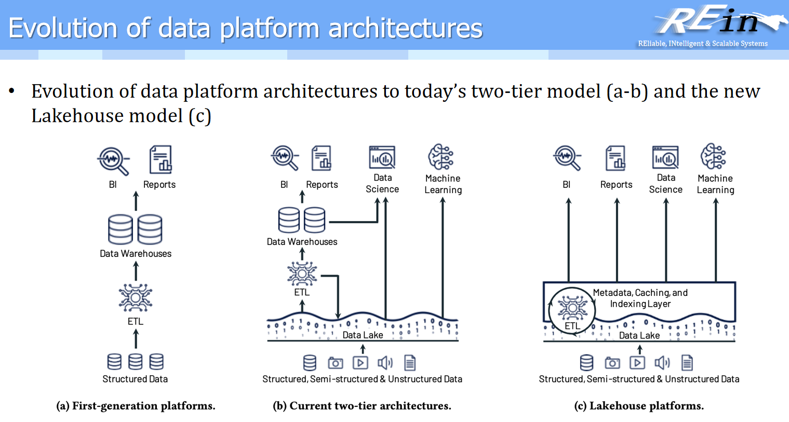

# Datalake

## 1 数据仓库和数据湖

### 1.1 数据仓库

数据仓库是**把来自不同业务系统的数据集中起来，经过清洗、转换和组织，专门用于统计分析、报表、决策支持的数据存储系统。**

核心特征经典四点：

- **面向主题（Subject-Oriented）**
  - 围绕销售、用户、商品、财务等分析主题组织数据
- **集成（Integrated）**
  - 整合多个异构数据源
  - 统一编码、格式、单位、口径等
- **相对稳定（Non-Volatile）**
  - 数据主要用于分析，通常不会频繁修改
  - 强调历史数据保留
- **随时间变化（Time-Variant）**
  - 保存不同时间的数据快照
  - 支持趋势分析、历史分析

数据内容一般来说通常是：

- **结构化数据**
- 已经定义好数据模型
- 数据质量较高
- 经过清洗、转换和治理

### 1.2 数据湖

**数据湖是一个以自然/原始格式存储数据的系统或数据仓库，通常是对象 blob 或文件。**

核心特征：**单一数据存储**：

- 数据湖通常是一个单一的数据存储
- 包含源系统数据的原始副本、传感器数据、社交数据等
- 同时包含用于报告、可视化、高级分析和机器学习等任务的转换数据
- 数据摄入极快，主要任务就是存储大量数据

数据湖可以包括多种类型的数据：（可以看成一个超大的、不加工的仓库），存入后保留原始格式。支持很多种数据格式：

- **结构化数据（Structured Data）**：
  - 来自关系数据库的数据（行和列）
- **半结构化数据（Semi-structured Data）**：
  - CSV、日志、XML、JSON 等格式
- **非结构化数据（Unstructured Data）**：
  - 电子邮件、文档、PDF 等
- **二进制数据（Binary Data）**：
  - 图像、音频、视频等

就部署方式而言，主要有以下方案：

- **本地部署（On Premises）**：
  - 在组织的数据中心内建立
- **云端部署（In the Cloud）**：
  - 使用云服务供应商提供的服务
  - 主要供应商包括：Amazon、Microsoft、Oracle Cloud、Google 等

优秀特点：

- 分布式存储，扩展性极好
- 摄入数据速度极高，限制条件取决于带宽
- 数据保真度高

### 1.3 数据湖的核心能力

数据湖是一个集中式仓库，设计用于存储、处理和保护大量的结构化、半结构化和非结构化数据：可以以原生格式存储数据，也可以处理任何类型的数据，忽略大小限制。

数据湖提供了一个可扩展且安全的平台，允许企业实现以下功能：

1. **数据摄入（Data Ingestion）**
   - 可以从任何系统以任何速度摄入数据
   - 支持来自本地、云端或边缘计算系统的数据
2. **数据存储（Data Storage）**
   - 可以存储任何类型或任何容量的数据
   - 保持数据的完整保真度
3. **数据处理（Data Processing）**
   - 支持实时处理模式
   - 支持批处理模式
4. **数据分析（Data Analysis）**
   - 可以使用 SQL、Python、R 或任何其他语言进行分析
   - 支持第三方数据分析工具
   - 支持各种分析应用程序

### 1.4 对比数据仓库和数据湖

| 对比维度                      | 数据湖（Data Lake）                                    | 数据仓库（Data Warehouse）                                    |
| ------------------------- | ------------------------------------------------- | ------------------------------------------------------- |
| **数据结构（Data Structure）**  | 原始数据（Raw）                                         | 处理过的数据（Processed）                                       |
| **数据用途（Purpose of Data）** | 尚未确定（Not yet determined）                          | 当前使用中（Currently in use）                                 |
| **用户（Users）**             | 数据科学家（Data scientists）                            | 业务专业人员（Business professionals）                          |
| **可访问性（Accessibility）**   | 高度可访问且快速更新（Highly accessible and quick to update） | 更复杂且更改成本更高（More complicated and costly to make changes） |

**主要区别总结**：

1. **数据结构**：
   - **数据湖**：存储原始、未处理的数据，保持数据的原始格式和完整性
   - **数据仓库**：存储经过清洗、转换和结构化的数据，通常采用星型或雪花型模式
2. **数据用途**：
   - **数据湖**：数据用途尚未明确，适合探索性分析和未来需求
   - **数据仓库**：数据用途已明确，用于特定的业务报告和分析
3. **目标用户**：
   - **数据湖**：主要面向数据科学家，需要深入分析和挖掘数据
   - **数据仓库**：主要面向业务专业人员，用于日常业务决策和报告
4. **灵活性和成本**：
   - **数据湖**：高度灵活，易于更新和扩展，访问成本低
   - **数据仓库**：结构相对固定，更改需要更多时间和成本

## 2 Lambda 架构与流批一体

### 2.1 实时处理与批处理

#### 实时处理（Real-time Processing）

- **定义**：数据一产生或到达系统，就立刻被处理，系统对外提供**低延迟（毫秒级或秒级）**的响应
- **核心关键词**：低延迟、持续流入、即时响应
- **主要特征**：
  - 数据是连续流式到达（Stream）
  - 强调时效性，允许结果不断更新
  - 通常是事件驱动
  - 延迟要求高

#### 批处理（Batch Processing）

- **定义**：先收集一批数据，等到一定时间或数量后，再统一进行处理，不追求即时结果
- **核心关键词**：吞吐量、离线、定期执行
- **主要特征**：
  - 数据是静态或准静态
  - 处理周期固定（分钟 / 小时 / 天）
  - 更关注整体效率和准确性
  - 延迟高（分钟 ~ 小时）

### 2.2 早期架构的局限

- **核心存储**：以 HDFS 为核心存储
- **计算模型**：以 MapReduce 为基本计算模型
- **局限性**：HDFS 批处理无法满足实时性要求高的场景

### 2.3 Lambda 架构

#### 产生背景

- 流数据是源源不断的，需要实时处理层
- filter 必须马上过滤完，不能等待批处理
- 解决方案：在原先的批处理引擎上增加流处理引擎，形成 Lambda 架构

#### 特点

- 进来的数据既可以以流的方式处理，也可以以批的方式处理
- 最终都放在一个统一的数据存储的地方
- 对外提供流处理和批处理两种方式

### 2.4 流批一体

- **时间窗口机制**：
  - 对流处理划定一个时间窗，对时间窗内的内容进行统一处理
  - 在每个时间窗内就是一个批处理
  - 流处理可以按照批处理的方式去分析
- **统一引擎**：
  - 通过调整时间窗的大小，只需要一个批处理引擎就可以实现流批一体
  - 加大流计算的并发性与“时间窗口”，统一流/批处理

## 3 湖仓一体

### 3.1 湖仓一体（Lakehouse）

- **存储方式**：湖仓一体的存储方式
- **ETL 处理**：
  - 数据是否需要 ETL 由具体用途决定
  - 不需要额外进行 ETL，在湖仓一体内部即可完成
  - 第一代必须经过 ETL 才能获得结构化数据
  - 第二代需要结构化的数据可以通过 ETL 获得
  - 现在是 Lakehouse，湖仓一体，统一管理

### 3.2 底层存储

现在的数据湖底部基本上是：

- **HDFS**（Hadoop 分布式文件系统）
- **Amazon S3**（亚马逊对象存储服务）
- **Microsoft Azure**（微软云存储服务）

## 4 边缘计算架构

### 4.1 边缘节点

- **定义**：小的服务器基站属于边缘节点
- **功能**：供给边缘设备的计算与存储
- **边缘设备示例**：摄像机、手机等

### 4.2 数据上传流程

- **数据传输**：由边缘服务器定期把数据传到核心机房
- **数据压缩**：在上传时数据会经过一些压缩处理，可以减少带宽占用

### 4.3 边缘数据查询

- **问题**：在中心节点需要查找数据时，如何确定数据存在哪个边缘节点？
- **解决方案**：
  - 生成查询计划，推到各个边缘节点里面查询
  - 边缘架构需要采用 KV 方式存储

### 4.4 全局数据索引

为了支持边缘数据的查询，添加了全局数据索引：

- **B+ 树**（B+ Tree）
- **布隆过滤器**（Bloom Filter）
- **Rosetta 过滤器**（Rosetta Filter）
- **Mini-Rosetta 过滤器**（Mini-Rosetta Filter）

## 5 计算平台演变分析（3 阶段）

数据平台架构大致经历三代演进：

### 5.1 第一代：以数据仓库为中心

- 输入主要是**结构化数据**
- 经 **ETL** 进入 **Data Warehouse**
- 主要服务 **BI / Reports**
- 特点：链路清晰，但难以直接容纳半结构化 / 非结构化数据

### 5.2 第二代：Data Lake + Data Warehouse 双层架构

- 输入扩展为结构化、半结构化与非结构化数据
- 原始数据先进入 **Data Lake**
- 再经 ETL 抽取部分数据进入 **Data Warehouse**
- 仓库继续服务 BI / Reports；湖侧可直接支撑 Data Science / Machine Learning
- 特点：能力更全，但存在冗余存储与复杂管道

### 5.3 第三代：Lakehouse

- 数据仍主要落在 Data Lake
- 之上增加统一的 **Metadata / Caching / Indexing** 层
- ETL 与数据管理更多在该层内完成
- 同一平台直接服务 BI、Reports、Data Science、Machine Learning
- 特点：用湖的低成本存储，补齐仓库式的管理与分析能力，统一治理

## 6 数据沼泽问题

数据湖如果只强调“什么都能存”，却缺少治理，数据会不断堆积并逐渐失控：难找、难理解、难信任，甚至不敢用。这种状态通常称为**数据沼泽（Data Swamp）**。

数据湖本身侧重原始数据存储，强调**先存储再使用**，各类数据可以快速直接写入；若不加控制，几年内就容易出现口径混乱、重复堆叠、质量参差等问题。

### 6.1 主要表现

- **找不到数据**：缺少元数据（Metadata）、数据目录（Data Catalog）、索引和血缘（Data Lineage），湖里到底有没有目标数据往往不清楚
- **看不懂含义**：`user_id` / `customer_id` / `uid`，或 `revenue` / `sales` / `amount` 这类字段是否同义、口径如何，缺少数据字典就很难判断
- **质量下降**：缺失、重复、脏数据、异常值、过期数据和格式不一致都会出现；**存在 ≠ 可用**
- **版本混乱**：同一主题反复上传 `customer.csv`、`customer_v2.csv`、`customer_final.csv` 等，难以确认哪份是最新权威版本
- **安全与权限失控**：敏感数据未脱敏、访问边界不清，泄露风险上升
- **血缘不清**：报表数字无法追溯到源系统与中间 ETL / 转换步骤

### 6.2 为什么数据湖更容易变成沼泽

数据湖常用 **Schema-on-Read**：写入时不强求先定完整模型，读的时候再解释结构。

这带来很高的灵活性，但也意味着：如果只有“存”、没有“管”，数据规模越大，检索、理解和信任成本上升得越快，最终滑向数据沼泽。

### 6.3 应对方式：数据治理

解决数据沼泽的核心是**数据治理（Data Governance）**，常见手段包括：

1. **元数据管理**：说明数据是什么、字段含义、来源、更新时间和负责人
2. **数据目录（Data Catalog）**：支持按业务需求检索，并返回位置、格式、责任人和质量概况
3. **数据质量管理**：检查完整性、准确性、一致性、唯一性和时效性
4. **数据血缘**：记录从原始数据到清洗、转换、数据集再到报表的处理链路，便于追溯
5. **权限与安全**：明确谁能访问哪些数据、能执行哪些操作
