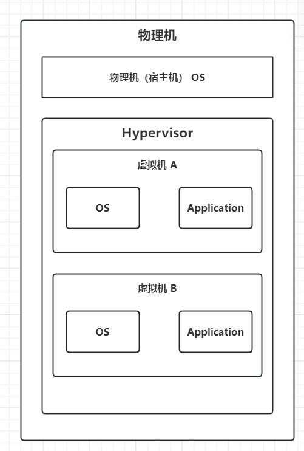
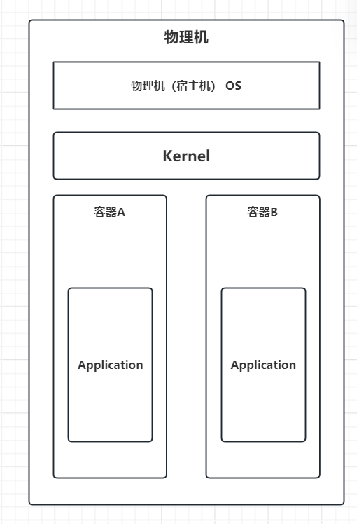
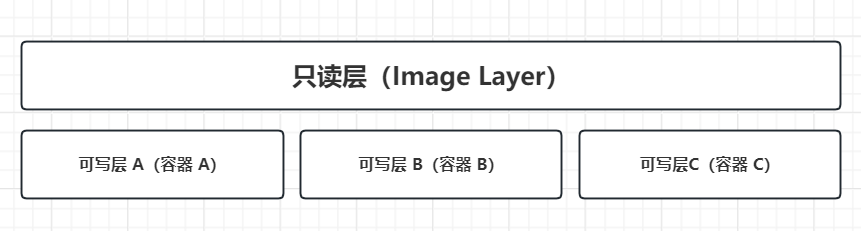
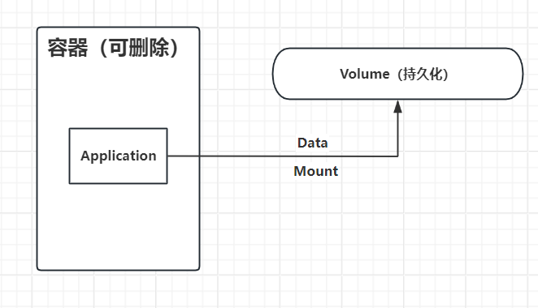

# Container

## 1 沙盒环境

很多应用程序可能会需要大量计算机的敏感权限，这就可能带来风险，因为如果是恶意程序或者故障程序可能带来意想不到的后果。

因此，给程序提供一个“隔离的实验场”，让它可以运行、读写文件、联网等，但即使程序出问题，也尽量不会影响真实系统。这个环境即为**沙盒**环境。

AI Agent的开发测试中沙盒尤为重要，诸如OpenClaw、DeerFlow 等都会让 Agent 自主执行代码、命令和工具操作，而这些操作可能具有破坏性或接触不可信内容，所以需要沙盒把 Agent 的执行环境与宿主机隔离。

## 2 容器

在实际工程中，如何快速、方便地构建这样的隔离运行环境？容器技术就是一种常见的实现方式。

容器可以看作一种轻量级的沙盒环境，通过进程、文件系统、网络和资源等隔离机制，为应用提供相对独立的运行空间。

容器有三个核心的隔离机制：**namespace、cgroups、rootFS**

### 2.1 namespace（命名空间隔离）

- **作用**：提供进程、网络、文件系统等资源的隔离视图
- **隔离内容**：
  - **PID Namespace**：进程隔离，容器内的进程只能看到容器内的进程
  - **Network Namespace**：网络隔离，容器拥有独立的网络栈和 IP 地址
  - **Mount Namespace**：文件系统隔离，容器有独立的挂载点视图
  - **UTS Namespace**：主机名和域名隔离
  - **IPC Namespace**：进程间通信隔离
  - **User Namespace**：用户和用户组隔离
- **核心功能**：让容器内的进程认为自己在独立的系统中运行

### 2.2 cgroups（控制组）

- **作用**：限制和隔离容器对系统资源的使用
- **控制内容**：
  - **CPU 限制**：限制容器可以使用的 CPU 时间片
  - **内存限制**：限制容器的内存使用量
  - **I/O 限制**：限制容器的磁盘和网络 I/O
  - **设备访问**：控制容器对设备的访问权限
- **核心功能**：防止容器消耗过多系统资源，确保多个容器可以安全地共享宿主机资源

### 2.3 rootFS（根文件系统）

- **作用**：为容器提供独立的文件系统视图
- **实现方式**：
  - 使用联合文件系统（Union File System，如 OverlayFS、AUFS）
  - 将多个文件系统层叠加在一起
  - 只读的基础镜像层 + 可写的容器层
- **核心功能**：
  - 容器拥有独立的文件系统，与宿主机和其他容器隔离
  - 支持镜像的分层存储和共享
  - 提供容器启动所需的所有文件和目录

### 2.4 **三者如何共同定义容器**

这三个机制共同工作，完整定义了容器：

1. **Namespace**：提供"看起来像独立系统"的隔离视图
   
   - 让容器内的进程认为自己在独立的系统中运行
   - 隔离进程、网络、文件系统等资源

2. **Cgroups**：提供"资源使用限制"的隔离
   
   - 确保容器不会消耗过多系统资源
   - 允许多个容器安全地共享宿主机资源

3. **RootFS**：提供"独立的文件系统"的隔离
   
   - 为容器提供完整的文件系统环境
   - 包含应用程序运行所需的所有文件和依赖

**三者结合效果**：

- **Namespace** 让容器"看起来"独立
- **Cgroups** 让容器"受限制"地运行
- **RootFS** 让容器"拥有"独立的文件系统

这三个机制缺一不可，共同构成了容器的完整定义，实现了轻量级、可移植、隔离的应用运行环境。

这些容器彼此独立运行时，都好像独占了计算机资源，彼此互不影响。

## 3 镜像（Image）

容器是**运行中的环境**，但每次创建都要准备应用、运行时、依赖、配置和文件系统。若每次手工配置，既繁琐，也难以保证不同机器上环境一致。

因此，把创建容器所需的文件系统与应用环境**预先打包**成可复用模板，就是**镜像（Image）**。

镜像是一个**只读、分层**的文件系统模板，包含运行应用所需的代码、依赖、配置和文件系统（对应前文 rootFS 中的只读基础层）。

### 3.1 镜像通常包含什么

| 类别                     | 内容           |
| ---------------------- | ------------ |
| **依赖（Dependencies）**   | 应用库、系统级依赖包   |
| **配置（Configurations）** | 应用配置、必要的系统配置 |
| **脚本（Scripts）**        | 启动脚本、初始化脚本   |
| **二进制文件（Binaries）**    | 可执行文件、编译产物   |

工程上还会附带运行与元数据信息：

- **环境变量（ENV）**：容器运行时的默认环境
- **默认命令（CMD / ENTRYPOINT）**：容器启动时执行什么
- **其他元数据**：作者、版本、构建信息等

### 3.2 镜像与容器的关系

- **镜像 = 模板（只读）**；**容器 = 镜像的运行实例**
- 运行容器：基于镜像实例化，挂到容器运行时（如 Docker）上
- 此时容器通常拥有独立的网络命名空间（独立 IP / 端口视图），以及一层可写的容器层叠在只读镜像之上

```text
镜像（只读模板） ──实例化──▶ 容器（运行中 + 可写层）
```

### 3.3 镜像的分层机制

镜像在本地按**层（layer）** 存储与注册，由联合文件系统叠加而成。

- **层可共享**：构建新镜像时，本地已有的层可直接复用，不必重复构建或下载
- **多容器共享底层**：相同基础层只需存一份，多个容器各自叠加自己的可写层

**好处：**

- 节省磁盘空间
- 加快构建与拉取速度
- 便于增量更新（只传变化的层）

## 4 虚拟机

容器通过 **Namespace、Cgroups 和 RootFS** 等机制，为应用提供相对隔离的运行环境，但**容器之间通常共享宿主机的操作系统内核**。

如果希望不同运行环境之间不仅隔离应用和文件系统，还拥有**独立的操作系统和内核**，就需要使用**虚拟机（Virtual Machine，VM）**。

### 4.1 虚拟机与容器的区别

虚拟机通过**硬件虚拟化**，在一台物理机器上模拟出多台独立的计算机。每台虚拟机都可以拥有自己的：

- 操作系统
- 内核
- 文件系统
- 应用程序和依赖

因此，虚拟机的基本结构可以表示为：



而容器更类似于：



因此二者最核心的区别是：**容器共享宿主机内核，而虚拟机拥有独立的 Guest OS 和内核。**

### 4.2 为什么容器比虚拟机轻量？

创建虚拟机时，需要为 Guest OS 准备完整的操作系统环境，包括：Guest OS、Kernel、System Libraries、System Utilities等。

因此创建虚拟机通常需要额外安装和存储一个完整的操作系统。

而容器不需要单独安装 Guest OS。容器直接利用宿主机的内核，只需要提供应用运行所需的：Application、Dependencies、Configurations、Binaries、RootFS

因此**容器无需额外运行一个完整的操作系统，启动速度更快、资源开销更小；虚拟机则具有更强的隔离性，但需要承担 Guest OS 带来的额外开销。**

### 4.3 容器和虚拟机的对比

|               | 容器             | 虚拟机    |
| ------------- | -------------- | ------ |
| 隔离单位          | 应用/进程          | 整个操作系统 |
| 是否拥有独立 Kernel | 否              | 是      |
| 是否需要 Guest OS | 否              | 是      |
| 启动速度          | 通常较快           | 通常较慢   |
| 资源开销          | 较低             | 较高     |
| 隔离强度          | 相对较弱           | 通常更强   |
| 运行不同 OS       | 受宿主机 Kernel 限制 | 可以     |

## 4.4 容器为什么可以快速创建多个实例？

镜像提供了容器所需的基础文件系统和应用环境，因此同一个镜像可以快速实例化出多个容器.

这些容器共享镜像的只读层，同时拥有各自独立的可写层和运行状态。

因此，一个 Image 可以对应多个 Container。**Image 是静态模板，Container 是动态实例。**

### 4.5 Docker与虚拟机的问题

需要注意，**Docker 本身并不是虚拟机**。但是docker可以在Windows上提供类似Linux 环境的容器。

在 Linux 上，Docker 可以直接利用 Linux Kernel 提供的 Namespace、Cgroups 等隔离机制运行 Linux 容器。

而在 Windows、macOS 等非 Linux 系统上，由于 Linux 容器依赖 Linux Kernel，Docker Desktop 通常需要借助一个 Linux 虚拟化环境来运行 Linux 容器。

## 5 容器的数据存储持久化问题

容器通常是**临时的、可销毁的运行环境**。容器运行过程中产生的数据默认存储在容器的**可写层（Writable Layer）** 中。

当容器被删除时，这部分数据也会随之删除。



因此，如果应用需要保存数据库、用户上传文件等重要数据，就不能简单地依赖容器自身的可写层，而需要将数据存储在**容器生命周期之外**。

Docker 提供了 **Volume** 和 **Bind Mount** 等机制解决这一问题。

### 5.1 Volume（数据卷）

**Volume** 是由 Docker 管理的持久化存储区域，可以挂载到容器中的指定目录。

重新创建容器时，可以再次将同一个 Volume 挂载进去，从而恢复之前的数据。



### 5.2 Named Volume（命名卷）

#### 5.2.1 实现步骤

1. **创建卷**：我们需要先建立一个卷
2. **挂载卷**：
   - 我们再次运行容器的时候，除了对端口进行映射之外
   - 我们还需要对卷进行映射，对这个容器外挂这个卷

#### 5.2.2 **工作原理**

- **持久化机制**：
  - 将容器关闭或者删除以后，我们的卷还在
  - 重启容器的时候还会把这个卷挂载进去
  - 数据就不会丢失

#### 5.2.3 **特点**

- **位置管理**：Named Volume 的位置是由 Docker 来决定的
- **Docker 管理**：Docker 负责管理卷的生命周期和存储位置

### 5.3 Bind Mounts（绑定挂载）

若不想使用 Docker 管理的 Volume，而是希望把宿主机上**自己指定的目录**挂进容器，可用 **Bind Mount**。

典型需求：自己管理文件路径（如项目源码、本地配置），并在宿主机上直接编辑、实时反映到容器内——开发环境很常见。

| 特性       | Named Volume  | Bind Mount     |
| -------- | ------------- | -------------- |
| **路径谁定** | Docker 决定     | 用户指定宿主机路径      |
| **谁管理**  | Docker 管理生命周期 | 用户自己管理目录与权限    |
| **存储位置** | Docker 管理的目录  | 宿主机任意指定目录      |
| **适用场景** | 生产侧数据持久化、数据库等 | 开发共享代码 / 配置、调试 |

**特点小结：**

- 路径灵活，宿主机可直接访问文件
- 开发友好，改文件可即时进容器
- 也更依赖宿主机目录结构，移植性通常弱于 Named Volume

### 5.4 Volume 与 Bind Mount 怎么选

- **生产持久化、交给 Docker 管**：优先 **Named Volume**
- **开发联调、要挂本地目录**：用 **Bind Mount**

## 6 容器通信

多个容器要互相访问，通常需要先处在**同一个 Docker 网络**里；同一自定义网络内的容器可通过服务名 / 容器名解析并通信。

基本步骤：

1. 用 `docker network create <网络名>` 创建网络
2. 启动容器时加入该网络（如 `--network <网络名>`）
3. 容器之间使用网络内主机名或服务名访问

```text
docker network create app-net
docker run --network app-net ... 服务A
docker run --network app-net ... 服务B
# A 与 B 可在 app-net 内互相通信
```

## 7 Docker Compose 与容器化部署

手工逐个 `docker run` 启动多个相互依赖的容器（应用、数据库、缓存等）既繁琐又难复现。**Docker Compose** 用一份声明式配置，一次性定义并“提起”整套服务。

### 7.1 什么是容器的「提起」

在 Docker 语境里，「提起」容器通常指**启动 / 运行**容器（start / run）：

1. 基于镜像创建容器实例
2. 启动实例，运行其中定义的进程 / 服务
3. 容器进入运行态，可对外提供服务或执行任务

Compose 的价值，就是按配置文件**批量提起**一组相关容器。

### 7.2 Docker Compose 解决什么问题

| 问题 | Compose 的做法 |
| --- | --- |
| 多容器要一个个启动 | 一份配置，一次 `up` |
| 端口、卷、环境变量散落在命令行 | 集中写在配置文件里 |
| 服务间有依赖、要同网 | 声明 `depends_on`、共享默认网络等 |

核心：**用一个配置文件管理多个容器的镜像、启动参数、网络、卷与依赖关系。**

### 7.3 配置文件 `docker-compose.yml`

常用文件名：`docker-compose.yml`（或 `.yaml`）。主要描述各 **service**（通常一个 service 对应一类容器）：

| 配置项 | 作用 |
| --- | --- |
| **services 名称** | 服务标识；同项目网络内常可用服务名互相访问 |
| **image / build** | 使用已有镜像，或基于 Dockerfile 构建 |
| **ports** | 端口映射，`宿主机端口:容器端口` |
| **volumes** | Named Volume 或 Bind Mount，做数据持久化 / 开发挂载 |
| **environment / env_file** | 环境变量 |
| **command / entrypoint** | 覆盖默认启动命令 |
| **networks** | 网络归属（默认会有项目网络） |
| **depends_on** | 启动顺序依赖（不等同于“依赖已就绪”） |
| **restart** | 重启策略等运行策略 |

示意结构：

```yaml
services:
  web:
    image: my-app:latest
    ports:
      - "8080:80"
    volumes:
      - ./app:/app          # Bind Mount 示例
    depends_on:
      - db
  db:
    image: mysql:8
    volumes:
      - db-data:/var/lib/mysql
    environment:
      MYSQL_ROOT_PASSWORD: example

volumes:
  db-data:                 # Named Volume
```

### 7.4 常用命令

| 命令 | 作用 |
| --- | --- |
| `docker compose up` | 按配置创建网络 / 卷并启动全部服务（前台） |
| `docker compose up -d` | 后台启动 |
| `docker compose down` | 停止并移除本项目创建的容器（及默认网络等） |
| `docker compose ps` | 查看服务状态 |
| `docker compose logs` | 查看日志（可加服务名） |

写好 `docker-compose.yml` 后，用 `docker compose up` 即可一键提起配置中的所有服务，并由 Compose 创建必要的网络与卷、按依赖关系编排启动。

### 7.5 Compose 的优势

1. **简化管理**：多容器配置集中在一个文件
2. **一键启动**：整套栈一起提起
3. **依赖与网络**：同项目服务默认互通，可用服务名通信（呼应 §6）
4. **环境一致**：开发 / 测试 / 演示用同一套声明，减少“我机器上能跑”
5. **与卷机制配合**：统一声明 Volume / Bind Mount（呼应 §5）

### 7.6 为什么要容器化部署

传统部署常把应用直接装在宿主机或虚拟机上：依赖版本、系统库、路径与配置都绑在某一台机器上。结果是：

- **环境漂移**：开发能跑、测试挂、生产又是一套依赖
- **交付慢**：装 OS、装中间件、改配置，步骤长且难自动化
- **隔离弱**：多个应用共机时抢端口、抢库、互相污染
- **扩缩难**：多开实例往往意味着再装一遍环境

容器化部署的核心思路是：把应用及其运行依赖**打进镜像**，在隔离的容器里运行，用 Compose / 编排工具声明网络、卷与副本。这样「交付物」从“一堆安装说明”变成“可运行的镜像 + 配置”。

#### 7.6.1 适合容器化的典型情况

| 情况 | 为何适合 |
| --- | --- |
| **多服务组合**（Web + DB + 缓存 + MQ） | 用 Compose 一键拉起整套栈，网络与依赖关系清晰 |
| **依赖复杂 / 版本敏感**（特定 Java、Python、系统库） | 依赖进镜像，宿主机只需容器运行时 |
| **要频繁部署、回滚、扩缩** | 换镜像 tag 即发布；多副本启动快 |
| **多环境一致性**（本机、CI、预发、生产） | 同一镜像流转，减少“环境不一致” |
| **微服务 / 云原生** | 服务边界清晰，便于独立发布与水平扩展 |
| **教学、演示、开源项目快速试用** | `compose up` 即可复现，降低上手成本 |

相对不那么优先、或需额外谨慎的情况：强依赖宿主机特殊硬件/驱动、极致内核级性能敏感、或强隔离要求已由虚拟机更好满足时，需权衡是否纯容器方案。

#### 7.6.2 容器化部署通常怎么做

```text
应用 + 依赖 ──Dockerfile──▶ Image
                              ↓
              docker-compose / K8s 等声明：服务、网络、卷、副本
                              ↓
                         拉取 / 启动容器
                              ↓
              无状态服务可多副本；有状态数据放 Volume / 外部存储
```

实践上常配合：配置与密钥外置（环境变量 / Secret）、健康检查与重启策略、日志与监控外挂，而不是写死在容器可写层里。

#### 7.6.3 优点

- **环境一致、可复现**：镜像即运行环境，减轻“在我机器上没问题”
- **隔离与密度**：同机多应用少互相干扰，比虚拟机更轻、启动更快
- **交付与扩缩简单**：构建一次、到处运行；水平扩展主要是再起容器
- **与微服务契合**：服务拆分后可独立构建、部署、回滚
- **运维标准化**：端口、卷、网络、健康检查可用统一编排描述

#### 7.6.4 缺点与代价

- **学习与工具链成本**：镜像构建、网络、存储、编排都有概念门槛
- **有状态服务更麻烦**：数据库等需认真设计 Volume / 备份，不能当无状态随意删容器
- **隔离弱于虚拟机**：共享宿主机内核，安全边界通常不如 VM
- **镜像与仓库治理**：体积、漏洞扫描、版本与供应链安全都要管
- **调试心智负担**：问题可能在应用、网络、挂载或资源限制多层之间
- **不适合一切场景**：强绑定宿主机、特殊内核模块等可能更适合传统或 VM 部署
