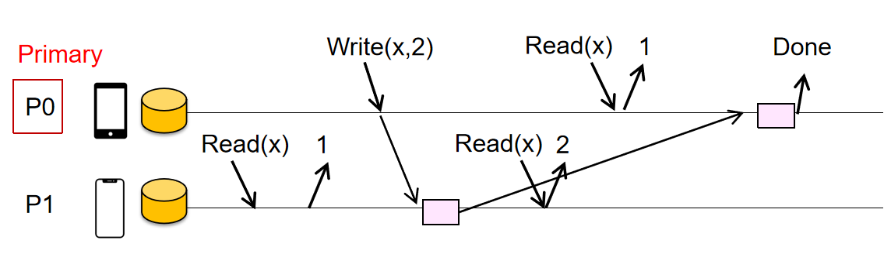

# Consistency when executing operations concurrently

## 1 分布式系统的数据不一致问题

某些设计中，为了简化，可能分布式的数据存储之间存在一定差异和不一致

## 8 Sequential Consistency（顺序一致性）

> The result of any execution is the same as if the operations of all the processors were executed in some sequential order, and the operations of each individual processor appear in this sequence in the order specified by its program.

**任何执行的结果，都等同于所有处理器的操作按照某种全局顺序依次执行，并且每个单独处理器中的操作，在该全局顺序中出现的顺序与其程序指定的顺序一致。**

- 全局排序（存在一个线性顺序）：所有进程（或线程）发出的所有读写操作，在总视角下能排成一条唯一的总顺序。

- **程序顺序不被破坏（进程内保序）**：最重要的一点。在这个全局排队中，同一个进程里的操作先后顺序，必须和它代码里的书写顺序（Program Order）完全一致。比如进程 P1 先写 x=1 再读 y，那么在全局顺序里，P1 的“写x”必须排在“读y”前面。

- 结果等价：所有进程最终看到的变量值，必须和按这个全局顺序一步步执行下来的结果一模一样。
