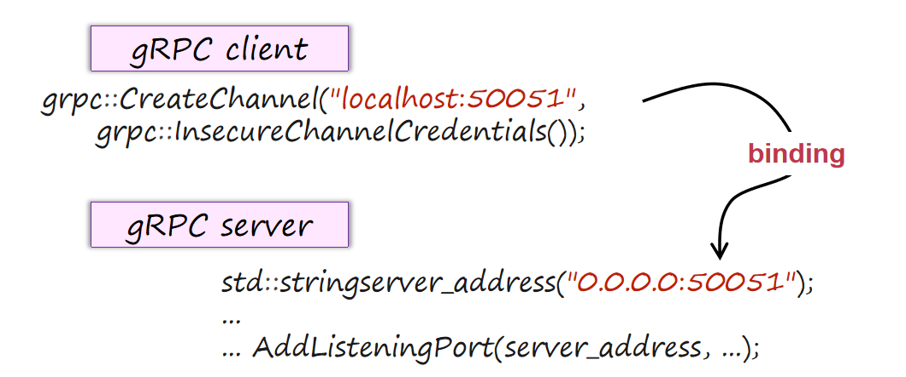

# Remote Procedure Call

## 1 分布式系统基本设计

- RPC的实现框架中，gRPC是最重要的之一，下面是gRPC的binding过程

- **服务器端：** gRPC 底层会创建 TCP Socket，调用 bind() 将其与端口 50051 关联，并调用 listen() 进入监听状态。
  
  - 0.0.0.0是一个通配地址 (Wildcard Address)。它表示服务器会监听本机所有可用的网络接口（网卡）。
  
  - 这意味着，无论是客户端通过 127.0.0.1（回环）、192.168.x.x（内网）、还是公网 IP 发来的连接请求，只要目标端口是 50051，这个服务器都能接收。
  
  - 监听端口号 50051（大于 1024），所以不需要 root 权限即可启动。

- **客户端**：CreateChannel 并不会立即建立网络连接（gRPC 默认是 Lazy Connect，在首次发送 RPC 请求时才拨号）。
  
  - 但当它拨号时，底层执行的是 connect() 系统调用。
  
  - 客户端会通过操作系统的 DNS 解析器（或 /etc/hosts 文件）将 localhost 解析为 IPv6 的 ::1 或 IPv4 的 127.0.0.1。

| 步骤             | 服务器 (0.0.0.0:50051)                                                                         | 客户端 (localhost:50051)                                                                  |
| -------------- | ------------------------------------------------------------------------------------------- | -------------------------------------------------------------------------------------- |
| **1. 解析地址**    | 解析 `0.0.0.0` -> 内核的 `INADDR_ANY`                                                            | 解析 `localhost` -> `127.0.0.1` (或 `::1`)                                                |
| **2. 创建套接字**   | `socket(AF_INET, SOCK_STREAM, 0)`                                                           | `socket(AF_INET, SOCK_STREAM, 0)`                                                      |
| **3. 设置选项**    | (可选) `setsockopt(SO_REUSEADDR)` 以便快速重启                                                      | 无                                                                                      |
| **4. 核心动作**    | **`bind(ip=0.0.0.0, port=50051)`** --> 系统内核在端口表中标记该端口被占用。 --> 调用 `listen()` 进入被动打开状态。 | **`connect(ip=127.0.0.1, port=50051)`** --> 内核自动分配源端口（如 52341）。 --> 发起 TCP 三次握手。 |
| **5. gRPC 握手** | 接受连接，升级至 HTTP/2，发送 SETTINGS 帧。                                                              | 接收 SETTINGS 帧，确认 HTTP/2 连接建立。                                                          |

## 6 参数传递

- 常见的参数传递有两种思路，值传递和引用传递，在RPC中只能选择前者，因为后者涉及到指针，会带来错误。

- RPC要求必须转化成没有指针的数据参与传输。服务器端再重新建立成有指针的数据结构。

- 参数传递实际上很复杂，编码顺序（大端法、小端法）、浮点数表示、对齐方法、变量的占用空间大小都会带来很多问题。还需要考虑升级的兼容性问题。

- 因此需要考虑规范的统一编码方式。例如Json、XML、Google Protocol Buffers 等**跨语言格式**。这种编码还利于人的阅读，便于debug。不过也存在缺陷：存在模糊和二义性，二进制的strings需要重新的编码，且需要使用更多的空间（tags like <xx> </xx> in XML）

- 还有可以利用**语言内置序列化工具**，常见语言特定格式：
  
  - Java: java.io.Serializable
  
  - Python: pickle 模块
  
  - C#: BinaryFormatter
  
  - Ruby: Marshal

但是存在一些问题，语言绑定问题 (Language Lock-in)使得跨语言互操作性差，版本兼容也比较困难，旧版本数据无法兼容新版本代码。

另一种思路是利用**二进制格式**，优点是更紧凑、准确，缺点是对人类阅读不友好，不利于调试处理。二进制和跨语言格式目前都很常见。二进制还可以进行进一步压缩使得信息内容更加紧凑。但是过度压缩会带来更多的解码时间，因此实际上需要做权衡。网络快速的情况下可以不追求极高的压缩。

## 7 RPC failure

一般来说本地PC（函数调用）不会出现Failure的问题，但是RPC可能出现。可能原因很多，比如参数格式错误、服务器崩溃、网络故障等等。

一次RPC可能出现不同的执行次数，语义上有三种常见场景：

- 最多一次 (At-Most-Once)
  
  - 系统保证请求不会被执行超过一次
  
  - 可能因为故障而根本不执行
  
  - 实现相对简单

- 至少一次 (At-Least-Once)
  
  - 系统保证请求至少执行一次
  
  - 在失败情况下会重试，可能导致重复执行
  
  - 需要业务逻辑处理幂等性

- 正好一次 (Exactly-Once)
  
  - 系统保证请求正好执行一次
  
  - 最理想但最难实现
  
  - 需要复杂的去重和事务机制

有一个专有名词进行描述：**幂等性（Idempotence）**。这意味着对同一个操作，无论执行一次还是多次，结果都相同（系统状态不会被重复改变）。

非幂等性（Non-idempotent）指的是，对同一个操作，执行一次和多次会带来结果的不同。