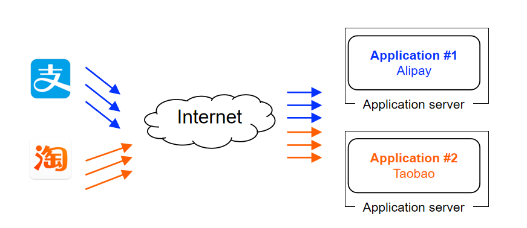
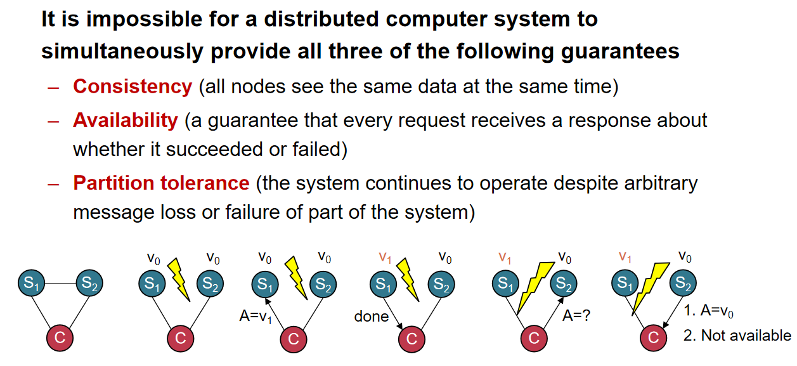

# Scalability in Practice

## 1 什么是Scalability

可扩展性，即当系统的负载、数据量、用户数等不断增长时，系统能不能通过增加资源来维持可接受的性能和稳定性。

现代大型服务系统通常都是分布式的系统，需要处理海量请求和可靠性，还有Transparent scale的能力。

Scalability的策略：

- ①disaggregating application /data将应用程序与数据存储在架构上分离，实现独立扩展。

/Scalability-in-practice/2026-08-13-09-55-00-image.png)

1. 独立扩展能力
   数据库层：可根据事务处理需求单独扩容
   文件存储层：可根据存储容量需求单独扩容
   应用层：可根据计算需求单独扩容
2. 专业分工
   每个组件专注于特定类型的任务
   优化资源配置和性能调优
3. 厂商支持
   Oracle等厂商：提供大规模数据量的数据库和文件系统解决方案
   成熟的商业支持和服务保障
- ②Avoid the slow data accesses（Caching）

/Scalability-in-practice/2026-08-13-09-55-40-image.png)

大多数请求只访问数据的一小部分（局部性 / locality）。单机有缓存系统，例如 OS 的 page cache，但是单机的 DRAM 容量有限；因此推出了分布式缓存服务器。好处是可以使用大量缓存服务器，获得“超大的 DRAM 总容量”。

- ③more app servers：增加服务器数量

这种策略在遇到大量的stateful请求时会出现问题。无状态请求每个请求都是独立的。
负载均衡器可以任意把请求分发到任意一台服务器。任何一台 server 都能处理请求，可以轻松增加/删除 server，完美支持横向扩展；而有状态请求会出现很多问题。

| **问题**     | **说明**                              |
| ---------- | ----------------------------------- |
| 状态被绑定到单台机器 | 用户或会话只能在某台机器上找到                     |
| 无法任意分发请求   | 负载均衡器必须保持“会话黏性”（session stickiness） |
| 机器增加无效     | 只能为新用户服务，已有用户仍固定在旧机器上               |
| 容错性下降      | 那台机器宕机，状态就丢失                        |
| 扩展复杂       | 需要同步状态到多台机器，或者集中存储                  |

## 2 LAMP架构

架构组成：**互联网用户 → 应用服务器 → 文件服务器 + 数据库服务器**

核心缺陷：LAMP架构扩展性差
关键瓶颈：CPU处理能力限制

物理限制背景

- 摩尔定律的终结
  
  - 定义：集成电路中晶体管数量每两年翻倍
  
  - 现状：物理极限导致这一定律逐渐失效
  
  - 影响：无法依赖硬件性能自动提升来满足扩展需求

- 登纳德缩放定律的终结
  
  - 定义：晶体管尺寸缩小时，功率密度保持恒定
  
  - 现状：量子效应和散热问题导致定律失效
  
  - 影响：无法在保持功耗不变的情况下持续提升性能

- 具体架构流程
  
  ```
  互联网用户
   ↓
  访问网站
   ↓
  应用服务器（CPU密集型）
   ↓ 生成网页内容
  文件服务器（存储图片） + 数据库服务器（用户、价格数据）
  ```

- 扩展性的挑战

| 挑战类别     | 具体描述                                        |
| -------- | ------------------------------------------- |
| **单点瓶颈** | 应用服务器成为性能瓶颈；所有动态内容生成集中在单一节点；CPU密集型任务难以水平扩展  |
| **硬件限制** | 无法依赖CPU频率提升获得性能增益；单核性能增长放缓；散热和功耗限制进一步制约性能提升 |
| **架构耦合** | 应用逻辑与数据访问紧密耦合；难以实现真正的分布式处理；扩展需要整体系统升级       |

解决方案包括切换为微服务架构和加入异步处理等等。

## 3 CDN与scalability

CDN 正是为了解决「在大规模访问下，中心服务器无法扩展」这一核心问题而诞生的。
CDN（内容分发网络） 是一组分布式部署的缓存节点（cache servers），它们分布在全球各地，靠近用户：

```
用户请求 → 最近的 CDN 节点 → 返回内容（若缓存命中）
 ↓
 缓存未命中 → 回源到 Origin Server
```

每个 CDN 节点会缓存常用内容（HTML、图片、视频、脚本等）。

| **维度**    | **没有 CDN**   | **使用 CDN**          |
| --------- | ------------ | ------------------- |
| **请求分布**  | 所有流量集中到源站    | 请求分散到多个节点           |
| **带宽**    | 源站带宽受限       | 总带宽 = 所有 CDN 节点带宽之和 |
| **响应延迟**  | 用户距离源站远      | 用户访问最近节点            |
| **扩展方式**  | 增加源站性能（垂直扩展） | 增加节点数量（水平扩展）        |
| **扩展成本**  | 极高           | 成本低，可线性扩展           |
| **抗流量洪峰** | 弱            | 强（可缓存热点内容）          |

## 4 Separate App

划分不同功能的APP可以实现性能优化和扩展。



可以使用容器进行不同的部署，还可以用K8s进行集群调度。
不过，随着需求发展，同一个APP内部可能会有更复杂的需求。这可以通过分布式的计算框架解决。

## 5 分布式系统

- 分布式系统是由一组通过网络互相通信、协作完成共同任务的独立计算机组成的系统，在用户看来它是一个统一整体。

- 现在的分布式系统依托于数据中心，计算资源丰富集中。有些问题是某些系统特有的，有些问题是所有分布式系统共有的。

- 服务器之间需要通信连接，一般通过网络实现。现在的数据中心一般采用分层级的方法。数据中心往往不止一个，既是为了备份，也是为了让全球的用户可以就近获得服务，降低延迟。跨数据中心的网络连接往往比数据中心内部的网络通信脆弱。

- 但是这意味着所有的分布式系统都必须考虑容错问题。
  
  > Fault can be latent or active
  > 
  > - if active, get wrong data or control signals
  > 
  > Error is the results of active fault
  > 
  > - e.g. violation of assertion or invariant of spec
  > 
  > - discovery of errors is ad hoc (formal specification?)
  > 
  > Failure happens if an error is not detected and masked
  > 
  > - not producing the intended result at an interface

- 分布式系统要求在多数主机工作的情况下系统可用正常工作。**（some parts of the system can be broken in some unpredictable way，Such failure is partial (aka., grey failure)；Since most parts of the system are OK, we want the system still working!）**

- 但这也造成如果系统崩溃，排查问题会变得很复杂。我们的目的在于，技术出现了fault或者error，在用户那里依旧可以正常使用功能。一种解决思路是，快速解决出现的failure，这样可以使得用户那里的使用不受到实际影响。

## 6 可用性与可靠性

- 可用性 (Availability)
  定义：系统在预定可使用时间内实际可用的时间比例
  计算公式：**可用性 = 系统可用时间 / 系统预定可使用时间**

- 可靠性 (Reliability)
  定义：系统在特定条件下无故障运行的能力

- 可用性等级标准：
  
  | “9”的数量 | 可用性百分比    | 年停机时间    | 典型应用    |
  | ------ | --------- | -------- | ------- |
  | 3个9    | 99.9%     | 8.76小时/年 | 普通商业系统  |
  | 5个9    | 99.999%   | 5.26分钟/年 | 电信级系统   |
  | 7个9    | 99.99999% | 3.15秒/年  | 极端高可用系统 |

- **MTTF (Mean Time To Failure)：平均无故障时间（衡量可靠性）**
  
  - 含义：系统从开始运行到首次发生故障的平均时间
  
  - 关注点：系统的耐用性和寿命
  
  - 计算方式：
    **MTTF = (所有设备无故障运行时间之和) / 设备总数**
  
  $$
  MTTF = \frac{1}{N} \sum^{N}_{i=1}TTF_i
  $$
  
  其中：
  
  $N = $ 系统设备数量
  
  $TTF_i = $ 第i个设备从开始到故障的运行时间

- **MTTR (Mean Time To Repair)：平均修复时间（衡量可靠性）**
  
  - 含义：系统从故障发生到修复完成的平均时间
  
  - 关注点：系统的可维护性和恢复能力
  
  - 计算方式：
    
    **MTTR = (所有故障修复时间之和) / 故障次数**
    
    $$
    MTTR = \frac{1}{N} \sum^{N}_{i=1}TTR_i
    $$
    
    其中：
    
    $N =$ 系统设备数量
    
    $TTR_i = $ 第i次故障修复时间

- **MTBF (Mean Time Between Failures)：平均故障间隔时间（衡量可靠性）**
  
  - 含义：系统在两次连续故障之间的平均运行时间
  
  - 关注点：系统的整体可靠性
  
  - **重要关系：$MTBF = MTTF + MTTR$**

## 7 不一致问题

设计的冗余会带来不一致问题。以下是两种方案：

- ①主备复制 (Primary-Backup Replication)
  工作原理：
  
  ```
  客户端请求 → 主节点 (Primary) → 同步复制 → 备节点 (Backup)
   ↓
  响应返回 ← 主节点确认 ← 备节点确认
  ```

- ②复制状态机 (Replicated State Machine)
  工作原理：
  
  ```
  客户端请求 → 所有副本节点
   ↓
  一致性协议 (如Paxos、Raft) 确保操作顺序一致
   ↓
  所有节点按相同顺序执行操作 → 保持状态一致
  ```

## 8 CAP原则



**Consistency, Availability & Partition tolerance**
**理论上，在进行网络分区的情况下不可能同时达到一致性和高可用。**

**CAP定理核心内容：三大保证的不可兼得性**
在分布式计算机系统中，不可能同时满足以下三个保证：

- 一致性 (Consistency)：所有节点在同一时间看到相同的数据，相当于"原子读写"或"事务一致性"

- 可用性 (Availability)：每个请求都能收到响应（成功或失败），系统始终处于可操作状态

- 分区容错性 (Partition Tolerance)：在网络分区（消息丢失、部分系统故障）时系统仍能运行，必须容忍网络不稳定性

这导致实际应用会有trade-off。金融类软件对于一致性要求很高，因此选择牺牲Availability。