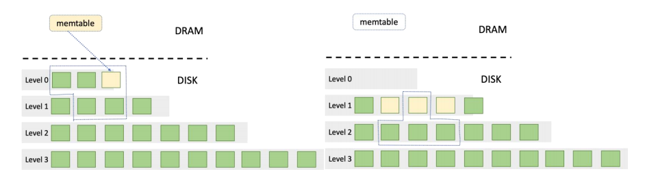

# LSM-Tree

## 1 LSM-Tree 的出现和发展

LSM-Tree 是一种面向高性能大批量写入的数据结构，于 1996 年被提出。

Google 的 LevelDB 和 Facebook 的 RocksDB 都以 LSM-Tree 作为核心存储结构。

## 2 基本设计思路



- 当 MemTable 大小达到阈值时进行 **转化**：把 MemTable 打包成 SSTable 放入 Level-0。
- 若 Level-0 文件数量超过阈值，则进行 **Compact**：
  - 取出 Level-0 的 **所有 SSTable**，以及与这些 SSTable 有区间交集的 Level-1 SSTable，做多路归并，去除重复数据中较旧的版本，将新生成的 SSTable 全部放入 Level-1。
  - 若 Level-1 也超限，则选取其中 **时间戳最老的** $x$ 个 SSTable（$x$ = 当前层文件数 − 该层理论上限），再选取下一层中与这 $x$ 个 SSTable 有范围交集的文件，一并多路归并，新 SSTable 放入下一层。
  - 以此类推，直到各层文件数量均符合要求。

#### 2.3.5 删除操作

- 系统整体是 Append-only，删除不能直接抹掉数据。
- 若发现 MemTable 中有对应 key 就直接删掉，会带来问题：磁盘上更老的记录会重新变成“最新”。
- 实际采用 tombstone：插入一个特殊 `DELETE` 值，仍按插入路径处理。
- 若 DELETE 标记在合并后到达当前最底层，则可真正清除；否则不能删。
- DELETE 的成本实际上被 **延迟到了 Compaction**。

#### 2.3.6 查找操作

1. **优先查询 MemTable**
   - 直接在 MemTable 中查找键 $K$。
   - 若找到，立即返回对应 value，流程结束。

2. **MemTable 未命中，则逐层检查 SSTable**
   - 按层级从低到高（Level 0 → Level 1 → …）依次遍历。
   - 对每一层，检查内存中缓存的该层各 SSTable 元信息（Bloom Filter 与索引）。

3. **单个 SSTable 的检查过程**
   - **Bloom Filter**：用 $K$ 查询；若“不存在”，跳过该文件。
   - **若可能存在**：在内存索引中 **二分查找**，定位数据 offset。
   - **磁盘读取**：按 offset 读取 value。
   - 若最新记录为 Tombstone，则视为不存在，返回 Not Found。

4. **遍历完所有层级仍未找到**
   - 说明键 $K$ 不存在，返回未找到或空值。

## 3 性能分析

测试与分析可得吞吐大致为：

$$
\text{PUT} > \text{DELETE} > \text{GET}
$$

PUT 吞吐最高，因为主要是 MemTable 纯写路径，Compaction 开销被分摊；DELETE 通常也是追加 Tombstone，但可能含额外删除判断，吞吐略低；GET 需在 MemTable 与多个 SSTable 中找最新版本，受读放大影响，通常最低。

## 4 读放大和写放大问题

LSM-Tree 的核心思想是将随机写转换为顺序写，但也会引入明显的 **Read Amplification（读放大）** 与 **Write Amplification（写放大）**。

### 4.1 读放大

由于采用多层 SSTable，同一 Key 可能存在多个版本，一次 GET 可能需要检查多个 MemTable / SSTable。

例如：

```text
MemTable
  ↓
Level 0
  ├── SSTable 1
  ├── SSTable 2
  └── SSTable 3
  ↓
Level 1
  ├── SSTable 4
  └── SSTable 5
  ↓
Level 2
  └── ...
```

若查询的 Key 不存在，MemTable 与多个 SSTable 都可能需要检查，最坏情况下要遍历大量文件。

读放大主要来自：

1. **多个层级**
2. **同一层中多个 SSTable**
3. **同一 Key 的多个历史版本**
4. **Compaction 尚未及时清理旧版本**

#### 4.1.1 Bloom Filter

可用 Bloom Filter 判断某个 SSTable 是否可能包含目标 Key：

```text
GET(K)
  ↓
Bloom Filter
  ├── 不存在 → 跳过 SSTable
  └── 可能存在 → 查询 Index
```

Bloom Filter 无假阴性，不会漏掉真实存在的数据；但可能有假阳性，导致访问实际不含该 Key 的 SSTable。它能显著减少无效磁盘访问，但无法完全消除读放大。

#### 4.1.2 Key Range

对 Level 1 及以上，不同 SSTable 的 Key Range 不重叠，可根据 `minKey` / `maxKey` 判断目标 Key 是否可能落在该文件：

```text
L1:
  SSTable 1: [0, 100]
  SSTable 2: [101, 200]
  SSTable 3: [201, 300]
```

查询 `K = 150` 时可直接定位到 SSTable 2。

因此：

- **L0**：允许 Key Range 重叠，可能需检查多个 SSTable
- **L1 及以上**：Range 不重叠，最多定位一个 SSTable

#### 4.1.3 Block Cache

即使已通过 Bloom Filter 与 Index 定位到 SSTable，仍可能要从磁盘读 Data Block。可用 Buffer Pool / Block Cache 缓存热点块：

```text
GET(K)
  ↓
Bloom Filter
  ↓
Index
  ↓
Block Cache
  ├── Hit  → 直接读取
  └── Miss → 磁盘读取
```

对有局部性的 workload，Block Cache 能显著降低实际磁盘读放大。

### 4.2 写放大

写放大主要来自 **Compaction**。

一次逻辑写入往往对应多次物理写入：数据先入 MemTable，再 Flush 成 SSTable；随后在 Compaction 中被反复读取、合并并写入更低 Level。

```text
PUT
  ↓
MemTable
  ↓ Flush
L0
  ↓ Compaction
L1
  ↓ Compaction
L2
  ↓
L3
```

同一份数据可能在多个阶段被重复写入磁盘。

> **LSM-Tree 用写放大换取了较高的随机写入性能。**

#### 4.2.1 为什么会产生写放大

假设写入了 100 MB 数据：

```text
100 MB → MemTable
100 MB → L0 SSTable   (Flush)
100 MB → L1           (Compaction)
100 MB → L2           (再次 Compaction)
```

仅这一份数据就可能产生约 `100 + 100 + 100 + 100` MB 的磁盘写入。实际 Compaction 还要读旧 SSTable 并与其他文件归并，I/O 更高。

#### 4.2.2 Compaction 策略对写放大的影响

不同 Compaction 策略会产生不同程度的写放大。

##### Leveled Compaction

每一层 SSTable 通常有较严格的 Key Range 划分。当 SSTable 从上一层落到下一层时，需与下一层中 Range 重叠的 SSTable 合并。

优点：

- 每层数据组织较紧凑
- 查询需检查的 SSTable 较少
- Read Amplification 较低

缺点：

- Compaction 较频繁
- 数据可能被多次重写
- Write Amplification 较高

##### Tiered / Size-Tiered Compaction

先积累多个大小相近的 SSTable，再一次性合并。

优点：

- Compaction 次数较少
- Write Amplification 较低
- 写入吞吐较高

缺点：

- 同一层可能有更多 SSTable
- GET 需检查更多文件
- Read Amplification 较高

典型权衡：

| Compaction 策略 | Read Amplification | Write Amplification |
| --------------- | ------------------ | ------------------- |
| Leveled         | 较低               | 较高                |
| Tiered          | 较高               | 较低                |

### 4.3 读放大与写放大的权衡

LSM-Tree 本质上是在不同资源之间权衡：

> **通过更多后台 Compaction 与写放大，换取更低的读放大和更好的查询性能。**

可简单表示为：

```text
Read Amplification ↓
        ↑
 Leveled Compaction
        ↑
Write Amplification
```

以及：

```text
Write Amplification ↓
        ↑
  Tiered Compaction
        ↑
Read Amplification
```

不存在对所有场景都最优的策略。

若系统主要是：

- 写多读少
- 大量顺序写入
- 对单次 GET 延迟要求较低

则可倾向于降低 Write Amplification。

若系统主要是：

- 读多写少
- GET 非常频繁
- 对读取延迟要求较高

则更需要降低 Read Amplification。

### 4.4 LSM-Tree 中的三种放大

除读/写放大外，还可考虑 **Space Amplification（空间放大）**：

| 指标                | 含义                           | 主要原因                      |
| ------------------- | ------------------------------ | ----------------------------- |
| Read Amplification  | 一次读取需访问多少额外数据     | 多层 / 多个 SSTable           |
| Write Amplification | 一次逻辑写入产生多少物理写入   | Flush、Compaction             |
| Space Amplification | 实际占用空间相对有效数据的倍数 | 历史版本、Tombstone、合并延迟 |

例如降低 Compaction 频率可减少写放大，但会导致更多旧版本残留、更多 SSTable，从而抬高读放大与空间放大。

完整优化是在 **Read / Write / Space Amplification** 三者之间找平衡。

## 5 可行的优化路径

### 5.1 WAL 与崩溃恢复

通过 WAL（Write-Ahead Logging）保证崩溃后能恢复尚未持久化到 SSTable 的数据：写操作先记 WAL，再更新 MemTable；崩溃后重放尚未进入 SSTable 的 WAL 记录即可恢复。可配合 Checkpoint，定期记录系统状态，避免恢复时重放过长的 WAL。

### 5.2 Batch Write

大量 PUT 同时到来时，不宜一条条单独写入。可积攒一批请求后批量处理，并在 WAL 中记录一次写入，从而：

- 减少 syscall
- 减少锁竞争
- 提高 CPU cache locality
- 提高吞吐

### 5.3 Buffer Pool

缓存最近访问 / 高频访问的 block，提高访存效率；替换策略可参考操作系统页缓存思路。

### 5.4 Immutable MemTable

为降低 MemTable 读写锁竞争，可拆成 Active MemTable 与 Immutable MemTable：

```text
Active MemTable
  ↓ 达到大小阈值
Immutable MemTable
  ↓
后台 Flush
  ↓
SSTable
```

Active MemTable 满后，不阻塞前台去同步构建 SSTable，而是转为 Immutable，同时新建 Active 接收写入。这样可以：

- 前台写请求持续执行
- Immutable MemTable 可并发读取
- Flush 放到后台线程
- 降低 Flush 对 PUT 延迟的影响

### 5.5 后台 Flush

MemTable → SSTable 不应阻塞前台请求。可划分为：

```text
Foreground
  ├── GET
  ├── PUT
  └── DELETE
Background
  ├── MemTable Flush
  └── Compaction
```

前台 MemTable 达阈值时，只需转为 Immutable，由后台写入 Level-0，从而避免同步生成 SSTable 导致的长尾延迟。
